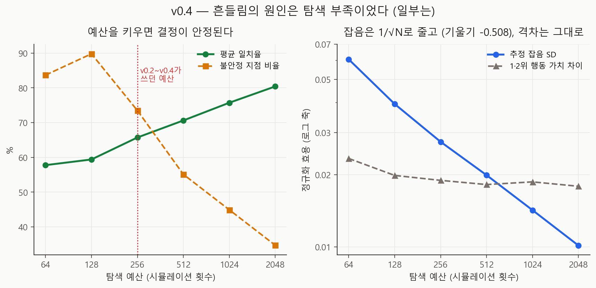
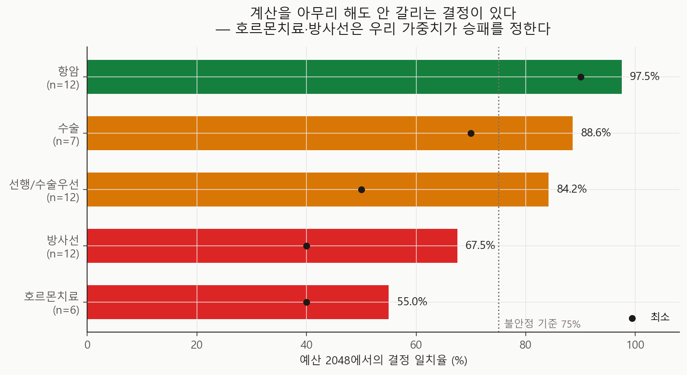

# 탐색 예산 스케일링 v0.4 기술 보고서

- 실행일: 2026-08-26
- 입력: `data/processed/patients_with_nccn.csv` + `configs/dynamic_poc_v0_2.json`
- 핵심 코드: `analysis/12_run_budget_scaling.py`
- 용도: v0.3에서 관찰된 **결정 불안정성의 원인**을 탐색 부족 / 진짜 동률로 판별
- 금지된 해석: 실제 임상효과, 인과효과, 최신 치료 우월성

## 한 줄 결론

**둘 다였다.** v0.2·v0.3이 쓴 256 시뮬레이션은 두 행동의 순서를 가릴 만한 해상도에
못 미쳤고(평균 separation 0.70 < 1), 예산을 2048로 올리자 일치율이 57.8% → 80.4%로
올랐다. 그러나 **49개 결정 지점 중 10개는 어떤 예산에서도 60% 아래**에 머물렀고, 그
지점들은 호르몬치료·방사선 결정에 몰려 있다. 즉 **불안정성의 다수는 우리가 탐색을
덜 돌린 탓이었고, 나머지는 어떤 계산으로도 없앨 수 없는 진짜 동률**이다.

## 왜 이 분석을 했나

v0.3 강건성 분석은 MCTS의 첫 결정이 시드 간 평균 62.9%만 일치한다는 것을 보였다.
이 숫자 하나에는 정반대의 두 해석이 모두 들어맞는다.

1. **탐색 부족** — 256 시뮬레이션이 너무 적어 가치 추정이 흔들리고 argmax가 뒤집힌다.
   예산을 늘리면 해결된다.
2. **진짜 동률(equipoise)** — 경쟁하는 두 행동의 기대효용이 우리 가정 아래에서
   실제로 거의 같다. 예산을 아무리 늘려도 갈라지지 않는다.

두 해석은 다음 할 일을 정반대로 만든다. 1번이면 계산자원을 더 쓰면 되고, 2번이면
"MCTS가 이 환자에게 X를 권한다"는 문장 자체를 쓸 수 없으며 대신 **동률 구간을
명시적으로 보고**해야 한다. 그래서 이 실험은 둘을 분리하는 것만을 목표로 한다.

## 판별 논리

각 결정 지점에서 같은 탐색을 여러 번 독립 반복하고, 예산을 키우며 두 값을 추적한다.

| 값 | 정의 | 예산을 키우면 |
|---|---|---|
| `value_noise_sd` | 반복 간 **추정치**의 표준편차 (몬테카를로 잡음) | 1/√N 로 줄어야 정상 |
| `value_gap` | 1위와 2위 행동의 **평균 추정치** 차이 | 환경의 성질이므로 안 변함 |

- 잡음이 줄고 **일치율이 오르면** → 원인은 탐색 부족.
- 잡음이 줄었는데 **일치율이 그대로이고 gap이 0 근처면** → 원인은 진짜 동률.

`separation = value_gap / value_noise_sd` 가 1보다 작다는 것은, 반복 간 흔들림보다
두 행동의 차이가 작다 — 즉 순서를 결정할 수 없다는 뜻이다.

## 설계

| 항목 | 값 |
|---|---:|
| 평가 환자 | 12명 (분자아형별 3명, robustness-v0.3과 동일 표본) |
| 결정 지점 | 49개 — 가이드라인 정책으로 걸었을 때 실제 도달하고 선택지가 2개 이상인 상태 |
| 예산 (Part A) | 64, 128, 256, 512, 1024, 2048 |
| 지점·예산당 반복 | 10회 (서로 다른 시드) |
| 예산 (Part B) | 64, 256, 1024 |
| 시드 (Part B) | 10 |
| 시드·정책당 episode | 25 |

Part B의 NCCN 정책은 탐색 예산과 무관하므로 시드당 한 번만 평가해 재사용한다.
또한 세 예산이 **같은 시드 집합**에서 돌기 때문에, 시드 내 짝지은(paired) 차이로
비교해 시드 간 분산을 제거한다.

## 결과 1 — 탐색은 정상 작동하고 있었다



| 예산 | 일치율 | 잡음 SD | \|gap\| | separation | 불안정 지점 비율 |
|---:|---:|---:|---:|---:|---:|
| 64 | 57.8% | 0.0605 | 0.0234 | 0.43 | 83.7% |
| 128 | 59.4% | 0.0394 | 0.0199 | 0.53 | 89.8% |
| **256** | **65.7%** | **0.0274** | **0.0189** | **0.70** | **73.5%** |
| 512 | 70.6% | 0.0199 | 0.0182 | 0.92 | 55.1% |
| 1024 | 75.7% | 0.0142 | 0.0187 | 1.32 | 44.9% |
| 2048 | 80.4% | 0.0101 | 0.0179 | 1.84 | 34.7% |

(불안정 = 반복 간 일치율 75% 미만)

두 가지가 동시에 확인된다.

1. **잡음의 log-log 기울기 = −0.508.** 몬테카를로 이론값 −0.5와 사실상 일치한다.
   탐색 자체에 버그가 있거나 수렴하지 않는 것이 아니라, 교과서대로 1/√N 로 줄고 있었다.
2. **`|gap|` 은 0.018 근처에서 거의 변하지 않는다.** 예산을 32배 늘려도 두 행동의
   실제 가치 차이는 그대로다. 예상대로 gap은 환경의 성질이고 예산의 함수가 아니다.

그 결과 separation(= gap / 잡음)이 예산과 함께 커지고, **512와 1024 사이에서 1을
넘는다**. 바꿔 말하면 **v0.2·v0.3이 쓴 256에서는 평균적으로 1·2위 행동의 순서를
분해할 수 없었다.** 지금까지의 모든 결정 단위 서술은 탐색의 해상도 아래에서 나온
것이었다.

## 결과 2 — 그래도 사라지지 않는 동률이 있다



예산 2048에서도 전부 해결되지는 않는다.

| 2048에서 | 지점 수 |
|---|---:|
| 일치율 ≥ 90% (사실상 확정) | 29 / 49 |
| 일치율 ≤ 60% (여전히 불안정) | 14 / 49 |
| **모든 예산에서 ≤ 60%** | **10 / 49** |

최소 일치율은 64부터 2048까지 **줄곧 40%** 였다. 어떤 지점들은 예산을 32배 늘려도
전혀 안정되지 않는다.

그 지점들이 어디인지가 중요하다. 2048에서 단계별 일치율은:

| 결정 단계 | 평균 일치율 | 최소 |
|---|---:|---:|
| 항암 (chemo) | 97.5% | 90% |
| 수술 (surgery) | 88.6% | 70% |
| 선행/수술우선 (timing) | 84.2% | 50% |
| 방사선 (radiation) | 67.5% | 40% |
| **호르몬치료 (endocrine)** | **55.0%** | **40%** |

항암·수술 결정은 예산만 주면 깨끗하게 결정된다. 반대로 **호르몬치료(표준 vs 연장)와
방사선(국소 vs 국소림프절) 결정은 계산을 아무리 해도 갈리지 않는다.**

이것은 v0.3 민감도 결론과 정확히 맞물린다. 설정 파일에서 연장 호르몬치료의 이득은
작고(사망 HR 0.98, 재발 HR 0.92) 부담·독성 가중치(0.06 / 0.10)와 거의 상쇄된다.
즉 **이 결정들의 승패는 임상 효과가 아니라 우리가 고른 보상 가중치가 정한다** —
v0.3이 "결론을 가장 크게 좌우하는 건 가치판단"이라고 말한 바로 그 지점이다.

## 결과 3 — 예산이 커지자 MCTS 우세도 커졌다

| 예산 | 효용 격차 (MCTS−NCCN) | 95% CI | 생존 격차 | MCTS 독성 |
|---:|---:|---:|---:|---:|
| 64 | +0.0152 | [+0.0095, +0.0209] | +2.1%p | 0.286 |
| 256 | +0.0212 | [+0.0153, +0.0271] | +1.8%p | 0.233 |
| 1024 | +0.0314 | [+0.0220, +0.0407] | +2.1%p | 0.178 |

같은 시드 안에서 짝지어 비교하면:

| 비교 | 격차 변화 | 95% CI | 0을 포함하나 |
|---|---:|---:|---|
| 1024 vs 256 | **+0.0102** | [+0.0027, +0.0176] | **아니오** |
| 64 vs 256 | −0.0060 | [−0.0135, +0.0015] | 예 |

**1024로 올린 효과는 시드 잡음으로 설명되지 않는다.** 동시에 MCTS의 평균 독성 건수가
0.286 → 0.178로 줄었다. 탐색을 더 하면 같은 생존을 덜 독한 경로로 얻는다.

### 다만 이것을 "MCTS가 더 낫다"의 근거로 쓰면 안 된다

예산을 늘리면 격차가 커지는 것은 **당연한 일**이다. MCTS는 이 시뮬레이터의 목적함수를
직접 최적화하고, NCCN 정책은 그렇지 않기 때문이다. 커진 격차는 "MCTS가 임상적으로
낫다"가 아니라 **"MCTS가 우리 합성 가정을 더 잘 활용한다"** 는 뜻이다. 가정이 틀렸다면
잘 탐색할수록 더 틀린 답으로 간다. v0.3 민감도 결과(가정을 흔들면 부호가 바뀜)와 함께
읽으면, 이 수치는 **오히려 가정 검증의 시급성을 키운다.**

## 무엇이 바뀌어야 하나

1. **앞으로의 실험 기본 예산은 1024 이상.** separation이 1을 넘는 최소 지점이다.
   256으로 낸 v0.2·v0.3의 결정 단위 수치는 "해상도 미달"이라는 단서와 함께 읽어야 한다.
2. **v0.3의 "62.9% 일치"는 과소평가였다.** 그 숫자의 상당 부분은 탐색 부족이었다.
   다만 결론(개별 권고를 단정할 수 없다)은 유지된다 — 20%의 지점은 여전히 동률이다.
3. **동률 지점은 숨기지 말고 그대로 보고한다.** 특히 호르몬치료·방사선 결정은
   "MCTS가 X를 권함"이 아니라 "이 환자에서 두 선택은 우리 효용 아래 동률"로 써야 한다.
4. **utility 사전등록의 우선순위가 더 올라갔다.** 동률이 몰린 결정들이 바로 보상
   가중치가 승패를 정하는 결정들이다.

## 한계

- 표본이 12명·결정지점 49개다. 단계별 일치율(특히 endocrine 6개 지점)은 표본이 작다.
- 결정 지점은 **NCCN 정책으로 한 번 걸었을 때** 도달한 상태들이다. MCTS가 다른 경로로
  갔을 때 만나는 지점은 포함되지 않는다.
- Part B는 25 episode·10시드다. v0.3(50 episode·20시드)보다 작아 CI가 더 넓다.
- 환경은 여전히 v0.2의 합성 가정 위에 있다. 이 보고서는 **탐색의 거동**만 검증했고
  임상적 타당성은 검증하지 않았다.

## 다음 단계

1. baseline propensity/IPW 시제품으로 target trial 에뮬레이션 착수 (v0.3 다음 단계 2번)
2. 2차원(상호작용) 민감도 격자 — 특히 보상 가중치 × 독성 확률
3. utility 가중치 문헌·환자선호 기반 사전등록 (동률 지점이 여기서 갈린다)
4. 동률 지점 비율을 metrics.json에 자동 산출로 편입 (지금은 아래 스니펫으로 재계산)
5. K-CURE 코드북 확보 후 변수 매핑 확정

## 산출물

| 파일 | 내용 |
|---|---|
| `metrics.json` | 판정(verdict)·잡음 기울기·예산별 일치율과 효용 격차 |
| `run_manifest.json` | 입력 SHA-256·base seed·실행 커밋 |
| `figures/fig18_budget_scaling.png` | 예산별 일치율·잡음 감쇠 |
| `figures/fig19_phase_agreement.png` | 단계별 일치율 (동률의 위치) |
| `tables/node_budget_detail.csv` | 결정 지점 × 예산 전체 원자료 (49 × 6행) |
| `tables/convergence_by_budget.csv` | 예산별 일치율·잡음·gap 요약 |
| `tables/root_convergence_by_budget.csv` | 첫 결정(root)만 따로 본 요약 |
| `tables/policy_per_seed.csv` | Part B 시드·예산별 결과 |
| `tables/utility_gap_by_budget.csv` | 예산별 효용 격차와 95% CI |
| `tables/utility_gap_paired_vs_256.csv` | 256 대비 시드 내 짝지은 차이 |

`metrics.json`의 `verdict`는 "잡음이 줄었는데 일치율이 안 오르는가"만 보는 거친
자동 판정이라 `budget_limited` 한 단어를 낸다. 위 결론의 "둘 다"라는 해석은
`node_budget_detail.csv`의 지점별 분포를 함께 읽어야 나온다.

## 재현

```powershell
py analysis\12_run_budget_scaling.py
```

단계별 일치율과 "모든 예산에서 불안정한 지점" 수는 산출된 표에서 다시 계산할 수 있다.

```powershell
py -c "import pandas as pd; d=pd.read_csv(r'reports/budget-scaling-v0.4/tables/node_budget_detail.csv'); print(d[d.budget==2048].groupby('phase').agreement_pct.agg(['mean','min','count'])); p=d.pivot_table(index=['patient_id','node_index'],columns='budget',values='agreement_pct'); print('always <=60%:', (p<=60).all(axis=1).sum(), 'of', len(p))"
```
