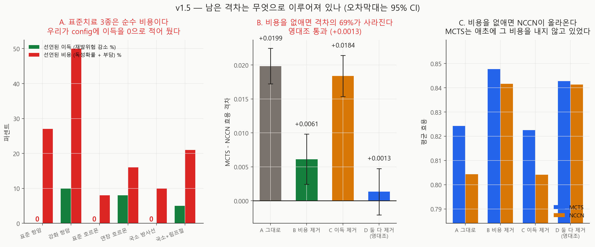

# 남은 격차는 무엇으로 이루어져 있나 — v1.5

- 실행일: 2026-09-07
- 입력: `data/processed/patients_with_nccn.csv` + `configs/dynamic_v0_5.json`
- 핵심 코드: `analysis/35_run_channel_decomposition.py`,
  `analysis/36_visualize_channel_decomposition.py`
- 용도: v1.4가 남긴 +0.0199를 **선언된 이득 × 선언된 비용** 2×2로 분해
- 금지된 해석: 실제 임상효과, 치료 권고

## 한 줄 결론

**남은 격차의 69%는 우리가 선언한 치료 비용을 MCTS가 피한 것이다.** 독성 페널티와
치료 부담을 0으로 두자 격차가 **+0.0199 → +0.0061**로 줄었다(짝지은 차이 −0.0137,
**z = −11.9**). 이유는 config에 있다 — **표준 항암·표준 호르몬·국소 방사선은 선언된
생존 이득이 정확히 0인데 비용만 있다.** 그리고 그 셋이 바로 NCCN이 가이드라인대로
처방하는 것들이다.

영대조(이득·비용 둘 다 제거)는 **+0.0013**으로 통과했다. 설계 자체는 건전하다.

## 추정 대상 (estimand)

> 같은 40명·같은 12시드·치료 중립 보상모형(v1.4)에서, config의 **선언된 치료 이득**과
> **선언된 치료 비용**을 각각 켜고 끈 2×2 하에서의 MCTS−NCCN 효용 격차.

## 왜 이 분석을 했나

v1.4는 보상모형의 교란된 치료 계수를 걷어내고 +0.0199를 남기면서, "이제 남은 것은
**선언된 채널**뿐 — 시점·반응·독성·재발"이라고만 적었다. **어느 채널인지는 재지 않았다.**

그런데 config를 표로 뽑으면 실행 전에 이미 문제가 보인다.

| 치료 수준 | 선언된 생존 이득 | 독성확률 | 치료 부담 |
|---|---|---:|---:|
| **표준 항암** | **없음** (HR 1.00 / 1.00) | 0.15 | 0.12 |
| **표준 호르몬** | **없음** (HR 1.00 / 1.00) | 0.05 | 0.03 |
| **국소 방사선** | **없음** (HR 1.00 / 1.00) | 0.05 | 0.05 |
| 강화 항암 | HR 0.95 / 0.90 | 0.30 | 0.20 |
| 연장 호르몬 | HR 0.98 / 0.92 | 0.10 | 0.06 |
| 국소+림프절 방사선 | HR 1.00 / 0.95 | 0.12 | 0.09 |

**표준치료 3종이 순수 비용이다.** v1.4 전에는 Cox 보상모형의 치료 계수가 "표준치료가
도움이 되나"를 대신 답하고 있었고 그 답은 "해롭다"였다. 중립화한 지금은 **config의 0만
남았다.** NCCN은 그 셋을 처방하고 MCTS는 거절할 수 있다.

## 설계

치료 중립 보상모형(v1.4) 위에서 2×2.

| 팔 | 선언된 이득 | 선언된 비용 |
|---|---|---|
| **A** 그대로 | config대로 | config대로 |
| **B** 비용 제거 | config대로 | 독성 페널티 0 · 치료 부담 전부 0 |
| **C** 이득 제거 | chemo·endocrine·radiation·timing 위험비 전부 1.0 | config대로 |
| **D** 둘 다 제거 | 1.0 | 0 |

**response 채널은 어느 팔에서도 건드리지 않았다.** v0.5에서 평균 중립화했으므로 기대
이득을 더하지 않지만, MCTS가 **적응**할 수 있는 유일한 대상 — 순차적 정책이 마땅히
가져야 할 **폐루프 이점**이다. 그것을 분리하는 것은 별도 질문이라 이 분해에서 뺐다.

**재현 검사**: A팔이 v1.4의 중립화 값과 `1e-9` 이내로 일치한다(`reproduces_v1_4_neutral`).

### 사전 선언한 예측 (실행 전 코드에 기록)

| # | 예측 | 결과 |
|---|---|---|
| 1 | **영대조** — D의 \|격차\| < 0.005 | **통과** (+0.0013) |
| 2 | **주 예측** — B가 A보다 훨씬 작다 | **적중** (−0.0137, z = −11.9) |
| 3 | C가 A보다 **크다** | **빗나감** — 아래 참조 |

## 결과



### ① 영대조가 통과했다

| 팔 | 효용 격차 | 시드 SE |
|---|---:|---:|
| A 그대로 | +0.0199 | 0.0013 |
| B 비용 제거 | **+0.0061** | 0.0019 |
| C 이득 제거 | +0.0184 | 0.0015 |
| **D 둘 다 제거 (영대조)** | **+0.0013** | 0.0017 |

치료가 돕지도 비용도 아닌 환경에서 격차가 **+0.0013**, 즉 표준오차 하나 안이다.
설계가 치료 이외의 무언가를 재고 있지 않다는 뜻이고, **이게 통과해야 나머지 해석이
의미를 갖는다.**

### ② 남은 격차의 69%는 비용 회피다

비용을 없앤 것만으로 **+0.0199 → +0.0061**, 짝지은 차이 **−0.0137 (z = −11.9)**.

그리고 **어느 쪽이 움직였는지**가 v1.4와 같은 모양이다.

| 정책 | A 그대로 | B 비용 제거 | 변화 |
|---|---:|---:|---:|
| MCTS | 0.8242 | 0.8477 | +0.0235 |
| NCCN | 0.8043 | 0.8416 | **+0.0373** |

둘 다 올라가지만 **NCCN이 훨씬 크게 올라간다.** MCTS는 애초에 그 비용을 내지 않고
있었기 때문이다(v1.4 기준 표준 항암 거절 68.9% 대 NCCN 7.5%).

### ③ 예측 3은 빗나갔다 — 이유가 내 추론의 오류다

C(이득 제거)가 A보다 **클 것**이라 적었다. 실제로는 **작았다**(+0.0184 대 +0.0199,
z = −1.05, 구분 불가).

내 추론은 "이득을 없애면 치료할 이유가 더 없어지니 MCTS가 더 거절하고 격차가 커진다"
였다. **틀렸다.** 실제로 움직인 것은 MCTS 쪽이다.

| 정책 | A 그대로 | C 이득 제거 | 변화 |
|---|---:|---:|---:|
| MCTS | 0.8242 | 0.8225 | **−0.0017** |
| NCCN | 0.8043 | 0.8041 | −0.0002 |

이유는 **선언된 이득에 접근할 수 있는 쪽이 MCTS뿐**이기 때문이다. 이득이 붙어 있는
치료는 강화 항암·연장 호르몬·국소+림프절 방사선인데, **NCCN은 그 셋을 한 번도 쓰지
않는다**(v1.4 행동 구성에서 전부 0%). 그러니 이득을 없애면 NCCN은 아무 영향이 없고
MCTS만 손해를 본다.

"치료할 이유"로 생각한 것이 잘못이었고, **"그 이득에 누가 닿을 수 있나"** 로 물었어야 했다.

### ④ 상호작용이 있다

2×2이므로 주효과와 상호작용을 분리할 수 있다.

| | 값 |
|---|---:|
| 비용 제거의 주효과 | **−0.0155** |
| 이득 제거의 주효과 | −0.0031 |
| **상호작용** | **−0.0033** |

비용이 있을 때 이득의 기여는 0.0015지만, 비용을 없애면 0.0048이 된다(B +0.0061 대
D +0.0013). 치료가 비쌀 때 MCTS는 전부 거절하므로 이득이 무의미해지고, 공짜가 되면
비로소 강화·연장 치료를 골라 이득을 챙긴다.

## 전체 분해 — 원래 +0.0332는 무엇이었나

| 성분 | 크기 | 원래 대비 | 근거 |
|---|---:|---:|---|
| 보상모형의 교란된 치료 계수 | 0.0134 | **40%** | v1.4 (z = −5.37) |
| 선언된 치료 **비용** 회피 | 0.0138 | **41%** | v1.5 (z = −11.9) |
| 선언된 치료 이득 활용 | 0.0015 | 4% | v1.5 (z = −1.05, 구분 불가) |
| 나머지 (폐루프 적응 포함) | 0.0013 | 4% | v1.5 영대조 |
| 아형 표집 보정 | — | (별도 축) | v1.2 |

**원래 격차의 81%가 두 가지 비대칭에서 나왔다** — 하나는 우리가 몰랐던 것(보상모형의
교란), 하나는 우리가 적어 놓고 잊은 것(표준치료에 이득 0).

남은 +0.0061 중 통계적으로 구분되는 부분은 사실상 없다. 영대조가 +0.0013이고 그
표준오차가 0.0017이므로, **MCTS가 NCCN보다 낫다는 우리 결과에서 방어 가능한 부분은
거의 남지 않았다.**

## 무엇이 바뀌나

1. **"MCTS가 NCCN보다 낫다"를 현재 환경에서 주장하지 않는다.** 원래 격차의 81%가
   두 비대칭에서 왔고, 남은 부분은 잡음과 구분되지 않는다.
2. **표준치료의 이득을 config에 선언하는 것이 최우선 과제**가 된다. 지금 환경은
   "가이드라인이 최적인가"에 답할 수 없다 — 가이드라인이 처방하는 치료에 이득을 주지
   않았기 때문이다.
3. **비교의 공정성 점검에 "각 정책이 접근할 수 있는 채널이 같은가"를 추가**한다.
   예측 3이 빗나간 이유가 그것이었다 — NCCN은 강화·연장 치료를 아예 쓰지 않으므로
   그쪽 이득에 닿을 수 없다.
4. **폐루프 적응 이점을 따로 재는 실험**이 다음 순서다. 영대조의 +0.0013이 그것을
   포함하는데, 지금 설계로는 잡음과 구분되지 않는다.

## 한계 (심각도 순)

- **이 분해는 "격차가 가짜"라고 말하지 않는다.** 격차는 실재하고 재현된다. 말하는 것은
  **그것이 우리 환경의 비대칭에서 나온다**는 것이다. 환경을 고치면 부호까지 달라질 수 있다.
- **표준치료 이득을 얼마로 선언할지는 이 자료가 답하지 못한다.** v1.3의 음성대조가
  실패했으므로 우리 인과추정치를 그대로 쓸 수 없다. K-CURE가 선행 조건이다.
- **영대조 +0.0013이 정확히 0은 아니다.** 표준오차 안이지만, 폐루프 적응과 잔여 구조적
  이점이 섞여 있을 수 있다. 분리하려면 별도 설계가 필요하다.
- **"비용 제거"는 극단 설정**이다. 실제로는 독성이 존재하므로, 이 팔은 기여도를 재는
  도구이지 더 옳은 환경이 아니다.
- 40명·12시드·합성 가정 위의 값이다.

## 다음 단계

1. **표준치료의 선언된 이득을 채운다** — K-CURE 수행상태·동반질환 확보가 선행 조건
2. **폐루프 적응 이점을 분리하는 실험** — response 채널을 정보 없는 형태로 만들어 대조
3. utility 가중치 **공동 사전등록** ← 여전히 사람 검토 대기
4. 교란요인 목록 임상 검토

## 산출물

| 파일 | 내용 |
|---|---|
| `metrics.json` | 사전 예측·판정·2×2 네 팔·선언된 비대칭 |
| `run_manifest.json` | 입력 SHA-256·시드·커밋 |
| `figures/fig40_channel_decomposition.png` | 선언된 비대칭·2×2·정책별 효용 |
| `tables/declared_asymmetry.csv` | 치료 수준별 선언된 이득과 비용 |
| `tables/per_seed_gaps.csv` | 팔 × 시드 격차 |
| `tables/action_mix.csv` | 팔 × 정책 × 결정별 행동 구성 |

## 재현

```powershell
py analysis\35_run_channel_decomposition.py
py analysis\36_visualize_channel_decomposition.py
```

`35`는 약 25분(4팔 × 12시드 × 40명).

## 참고문헌

- Gottesman O, et al. Guidelines for reinforcement learning in healthcare.
  *Nat Med*. 2019;25:16-18.
- Prasad N, et al. Defining the questions RL can answer in healthcare.
  *NeurIPS ML4H*. 2020.
- Saltelli A, et al. *Global Sensitivity Analysis: The Primer*. Wiley. 2008.
