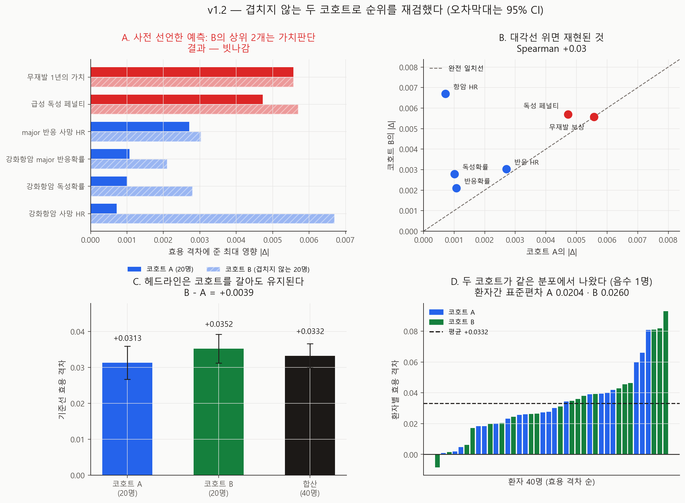
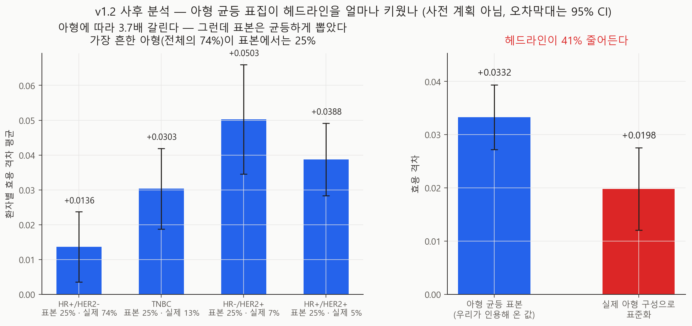

# 겹치지 않는 코호트로 순위를 재검했다 — v1.2

- 실행일: 2026-09-04
- 입력: `data/processed/patients_with_nccn.csv` + `configs/dynamic_v0_5.json`
- 핵심 코드: `analysis/28_run_cohort_replication.py`, `analysis/29_visualize_cohort_replication.py`,
  `analysis/30_run_subtype_standardisation.py`(사후)
- 용도: v1.1의 순위가 **처음 보는 환자 20명**에서도 나오는지 검증
- 금지된 해석: 실제 임상효과, 인과효과, 최신 치료 우월성

## 한 줄 결론

**사전 선언한 예측이 빗나갔다.** 겹치지 않는 코호트 B에서 1위는 가치판단이 아니라
임상 파라미터(강화항암 사망 HR)였고, **두 코호트 순위의 Spearman은 +0.03 — 사실상
무상관**이다. 살아남은 것은 **헤드라인 수치**뿐이다(A +0.0313, B +0.0352). 40명을
합치면 상위 2개가 다시 가치판단이 되지만, **그 합산은 예측을 검증하지 못한다** — 예측이
나온 코호트 A가 그 안에 들어 있다.

그리고 사후 분석에서 더 큰 것이 나왔다: **아형 균등 표집이 헤드라인을 41% 부풀리고
있었다**(+0.0332 → 실제 아형 구성으로 표준화하면 **+0.0198**).

## 추정 대상 (estimand)

> 각 가정을 v0.3이 정한 범위의 양 끝으로 옮겼을 때 MCTS−NCCN 효용 격차가 움직이는
> 최대 절댓값. **겹치지 않는 아형 균등 코호트 20명 두 개**에서 각각 추정.

## 왜 이 분석을 했나

v1.1은 코호트를 8 → 20명으로 늘려 순위가 유지되는 것을 보였지만, 스스로 한계를 적었다:
**세 코호트가 중첩**이라 20명이 8명을 포함한다. 중첩된 코호트의 일치는 재현이 아니라
**같은 사람을 다시 센 것**일 수 있다.

## 설계

| 코호트 | offset | 환자 | 역할 |
|---|---:|---:|---|
| A | 0 | 20 | v1.1의 코호트 (재현 검사 겸용) |
| B | 5 | 20 | **A가 한 번도 보지 못한 환자** |
| 합산 | — | 40 | 추가 탐색 없이 얻는 최대 코호트 |

`balanced_subtype_sample`에 `offset`을 더해 같은 추출 순서의 다음 구간을 뽑았다.
실행 중 **교집합이 공집합인지, 아형별 5명씩인지 코드가 검증**하며, 어긋나면 중단한다.
시드 12·예산 1024·episode 40·13개 변형은 v1.0/v1.1 그대로다.

두 코호트가 **같은 시드**에서 돌므로 환자 축으로 이어 붙이면 40명 결과가 추가 탐색 없이
나온다.

### 사전 선언한 예측 (실행 전 코드에 기록)

`metrics.json`의 `prespecified_prediction`에 그대로 들어 있다.

1. **주 예측** — 코호트 B의 상위 2개는 두 가치판단이다.
2. B의 기준선 격차는 양수다.
3. A와 B 순위의 Spearman은 양수다.

v1.1의 환자 부트스트랩이 주 예측을 **69.5%**로 봤으므로, **세 번에 한 번은 빗나갈 것**을
예상하고 적었다.

## 재현 검사

코호트 A의 기준선이 v1.1의 **0.03130208333333337**과 `1e-9` 이내로 일치한다
(`replication.cohort_a_matches_v1_1 = true`). 순위도 동일하다.

## 결과



### ① 주 예측은 빗나갔다

| 예측 | 결과 |
|---|---|
| B의 상위 2개가 가치판단 | **빗나감** |
| B의 기준선이 양수 | 적중 (+0.0352) |
| A·B 순위 Spearman > 0 | 적중이지만 **+0.03** — 사실상 0 |

**코호트 A** (v1.1과 동일)

| 순위 | 가정 | \|Δ\| | SE | z |
|---:|---|---:|---:|---:|
| 1 | **무재발 1년의 가치** | 0.0056 | 0.0027 | −2.03 |
| 2 | **급성 독성 페널티** | 0.0047 | 0.0017 | −2.74 |
| 3 | major 반응 사망 HR | 0.0027 | 0.0017 | +1.59 |
| 4 | 강화항암 major 반응확률 | 0.0011 | 0.0028 | −0.39 |
| 5 | 강화항암 독성확률 | 0.0010 | 0.0030 | −0.34 |
| 6 | 강화항암 사망 HR | 0.0007 | 0.0024 | +0.30 |

**코호트 B** (겹치지 않는 20명)

| 순위 | 가정 | \|Δ\| | SE | z |
|---:|---|---:|---:|---:|
| 1 | 강화항암 사망 HR | 0.0067 | 0.0028 | −2.42 |
| 2 | **급성 독성 페널티** | 0.0057 | 0.0032 | −1.76 |
| 3 | **무재발 1년의 가치** | 0.0056 | 0.0025 | +2.22 |
| 4 | major 반응 사망 HR | 0.0030 | 0.0023 | −1.34 |
| 5 | 강화항암 독성확률 | 0.0028 | 0.0032 | −0.87 |
| 6 | 강화항암 major 반응확률 | 0.0021 | 0.0027 | −0.77 |

A에서 **꼴찌**였던 강화항암 사망 HR(0.0007)이 B에서 **1위**(0.0067)다. 열 배 차이다.

### ② 순위 자체가 재현되지 않는다

Spearman **+0.03**. 여섯 개 파라미터의 순서가 두 코호트 사이에 **아무 관계가 없다.**

그런데 이것을 "B가 A를 반박했다"로 읽어도 안 된다. B 안에서 |Δ|의 전체 폭은 **0.0046**
인데 가장 넓은 95% 신뢰구간의 반폭이 **0.0064**다. **한 코호트 안에서는 여섯 개의
순서를 분해할 수 없다.** B의 1위와 3위 차이(0.0011)는 그 코호트의 표준오차보다 작다.

정확한 진술은 이렇다: **20명짜리 코호트 하나는 이 순위를 결정할 해상도가 없다.**
v1.1의 순위도, v1.2 B의 순위도 그 해상도 아래에서 나온 값이다.

### ③ 헤드라인은 코호트를 갈아도 유지된다

| 코호트 | 기준선 효용 격차 | 시드 SE |
|---|---:|---:|
| A (20명) | +0.0313 | 0.0024 |
| B (20명) | +0.0352 | 0.0020 |
| **합산 (40명)** | **+0.0332** | 0.0017 |

B − A = **+0.0039**, 각 코호트의 95% CI 안이다. 13변형 × 3집계 = **39개 셀 중 음수는 0개**다. 순위는 재현되지 않았지만 **"MCTS가 이 시뮬레이터에서 조금 낫다"** 는
재현됐다.

### ④ 40명을 합치면 상위 2개가 다시 가치판단이다 — 그러나 이것은 검증이 아니다

| 순위 | 가정 | \|Δ\| | SE | z |
|---:|---|---:|---:|---:|
| 1 | **무재발 1년의 가치** | 0.0054 | 0.0020 | −2.67 |
| 2 | **급성 독성 페널티** | 0.0052 | 0.0017 | −2.98 |
| 3 | 강화항암 사망 HR | 0.0034 | 0.0018 | −1.89 |
| 4 | 강화항암 독성확률 | 0.0019 | 0.0023 | −0.82 |
| 5 | 강화항암 major 반응확률 | 0.0013 | 0.0027 | −0.49 |
| 6 | major 반응 사망 HR | 0.0011 | 0.0024 | −0.44 |

|z| ≥ 2인 파라미터는 여전히 **그 둘뿐**이다. 이것이 현재 가장 좋은 추정이다.

**다만 이것으로 주 예측이 구제되지는 않는다.** 합산에는 예측이 도출된 코호트 A가 들어
있으므로 독립 검증이 아니다. 예측은 B에서 판정됐고, **B에서 빗나갔다.**

### ⑤ 처음으로 음수 환자가 나왔다

40명 중 **1명**(MB-5144, HR+/HER2−)의 격차가 **−0.0084**다.

v1.1은 20명 전원이 양수인 것을 보고 "부호는 전원 같다"고 썼다. **표본을 두 배로 늘리자
반례가 나왔다.** "MCTS가 모든 환자에게 낫다"는 서술은 이제 성립하지 않는다.

| | 값 |
|---|---:|
| 최솟값 | **−0.0084** |
| 중앙값 | +0.0289 |
| 최댓값 | +0.0930 |
| 환자간 표준편차 | 0.0232 (A 0.0204 · B 0.0260) |
| 환자간 표준오차 (40명) | **0.0037** |

40명에서 환자간 표준오차가 v1.1이 사전 선언한 목표(0.005) 아래로 내려왔다.

## 사후 분석 — 아형 균등 표집이 헤드라인을 41% 부풀리고 있었다

**사전 계획이 아니다.** 위 환자별 표를 보다가 아형에 따라 격차가 몇 배씩 갈리는 것을
발견해 추가한 분석이다(`analysis/30`, `metrics_posthoc_subtype.json`).



| 아형 | 표본 비중 | **실제 비중** | 평균 격차 |
|---|---:|---:|---:|
| HR+/HER2− | 25% | **74%** | **+0.0136** |
| TNBC | 25% | 13% | +0.0303 |
| HR−/HER2+ | 25% | 7% | **+0.0503** |
| HR+/HER2+ | 25% | 5% | +0.0388 |

**MCTS의 우세는 아형에 따라 3.7배 갈린다.** 그리고 우세가 가장 작은 아형(HR+/HER2−)이
실제로는 코호트의 **4분의 3**인데 우리 표본에서는 4분의 1이다.

| | 효용 격차 | 95% CI |
|---|---:|---|
| 아형 균등 표본 (지금까지 인용해 온 값) | **+0.0332** | [+0.0271, +0.0393] |
| 실제 아형 구성으로 표준화 | **+0.0198** | [+0.0120, +0.0276] |

여기의 신뢰구간은 **층별 환자간 표준오차**(0.0031·0.0040)에서 온 것이다. 위 ③의
0.0017은 **시드** 표준오차이고 다른 불확실성을 잰다 — 아형 구성을 바꾸는 대비에는
환자 쪽이 맞는 척도라 그것을 썼다.

**표준화하면 헤드라인이 41% 줄어든다.** 여전히 0을 넘지만, v0.3부터 지금까지 인용해 온
값은 **표집 설계가 키운 값**이었다.

아형 균등 표집 자체는 잘못이 아니다 — 8~20명짜리 코호트에서 HR−/HER2+(19명)나
HR+/HER2+(14명)를 보존하려면 필요했다. 문제는 그렇게 뽑은 표본의 평균을 **아무 조정
없이 헤드라인으로 써 온 것**이다.

## 무엇이 바뀌나

1. **민감도 순위는 코호트 하나로 말하지 않는다.** 20명은 해상도가 없다. 최소 40명이며,
   그래도 말할 수 있는 것은 **"상위 2개가 가치판단"** 이라는 그룹 수준까지다.
2. **v1.1의 "20명이면 충분"은 철회한다.** 평균을 재는 데는 충분했지만 순위를 매기는
   데는 아니었다.
3. **"모든 환자에게 낫다"는 서술을 제거**한다. 40명 중 1명이 음수다.
4. **헤드라인에 아형 구성을 명시**한다. 균등 표본 +0.0332, 표준화 +0.0198을 함께 쓴다.
5. **빗나간 예측을 기록으로 남긴다.** 예측을 먼저 적었기 때문에 이 결과가 의미를 갖는다.

## 한계 (심각도 순)

- **한 번의 복제로 순위를 기각한 것이 아니다.** B의 코호트 내 해상도가 부족해
  "A가 틀렸다"가 아니라 **"둘 다 결정할 수 없다"** 가 맞다.
- **아형 표준화는 사후이며 거칠다.** 4개 층 × 10명의 직접 표준화이고, 층 내 SE가
  0.005~0.008이다. 방향과 크기는 신뢰할 만하지만 정밀한 값이 아니다.
- **표준화의 기준 모집단도 METABRIC 보류 테스트셋**(1977~2005 영국)이다. 한국 유방암
  아형 분포는 다르다.
- **40명도 작다.** 순위 3~6위는 여전히 인용 불가다.
- **합성 가정 위의 값**이며 시뮬레이터의 민감도이지 임상 효과가 아니다.

## 다음 단계

1. utility 가중치 **공동 사전등록** — 합산 40명에서 구분되는 파라미터가 여전히 그 둘뿐
2. 헤드라인을 아형 표준화 값으로 재인용할지 팀 결정 (표집 설계의 문제이지 버그가 아님)
3. 교란요인 목록 임상 검토 (v0.7)
4. 겹침이 확보된 결정(항암·호르몬)의 효과 추정 완성
5. K-CURE 확보 후 순차 전략 비교

## 산출물

| 파일 | 내용 |
|---|---|
| `metrics.json` | 사전 예측·판정·코호트별 순위·환자 이질성 |
| `metrics_posthoc_subtype.json` | 아형별 격차와 표준화 (사후) |
| `run_manifest.json`, `run_manifest_posthoc_subtype.json` | 입력 SHA-256·시드·커밋 |
| `figures/fig34_cohort_replication.png` | 예측 판정·순위 일치·헤드라인·환자 분포 |
| `figures/fig35_subtype_standardisation.png` | 아형별 격차와 표준화 효과 |
| `tables/variant_results.csv` | 13변형 × 3집계 |
| `tables/parameter_influence.csv` | 파라미터별 최대 영향·SE·z |
| `tables/per_patient_gaps.csv` | 환자별 격차 (코호트·아형 포함) |
| `tables/subtype_standardisation.csv` | 아형별 평균·표본 비중·실제 비중 |

## 재현

```powershell
py analysis\28_run_cohort_replication.py
py analysis\30_run_subtype_standardisation.py
py analysis\29_visualize_cohort_replication.py
```

`28`은 약 2시간(39개 셀 × 12시드), `30`과 `29`는 탐색을 돌리지 않아 즉시 끝난다.

## 참고문헌

- Saltelli A, et al. *Global Sensitivity Analysis: The Primer*. Wiley. 2008.
- Nosek BA, et al. The preregistration revolution. *PNAS*. 2018.
- Rothman KJ, Greenland S, Lash TL. *Modern Epidemiology*, 3rd ed. (직접 표준화)
- Gelman A, Carlin J. Beyond Power Calculations. *Perspect Psychol Sci*. 2014.
