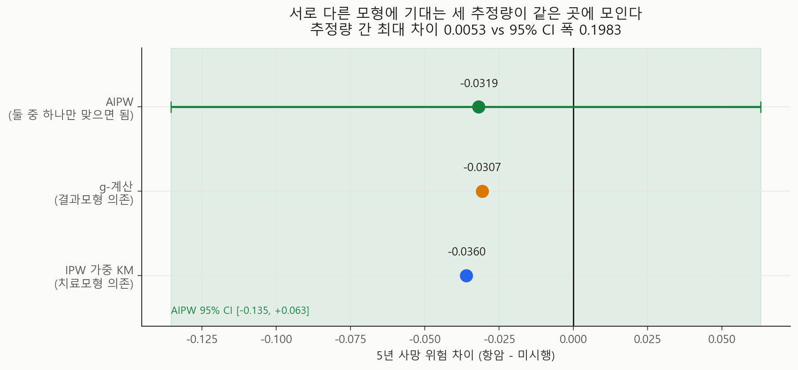
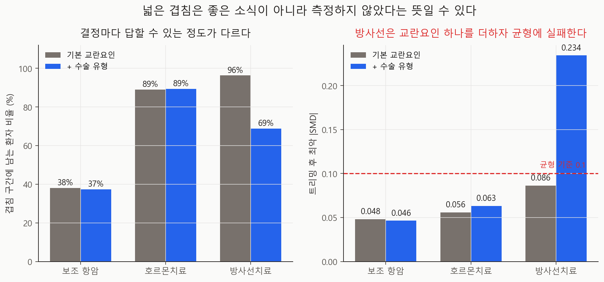

# 이중강건 추정과 결정별 식별 가능성 지도 v0.7

- 실행일: 2026-08-27
- 입력: `data/processed/patients_with_nccn.csv`
- 프로토콜: `docs/target-trial-protocol.md`
- 핵심 코드: `analysis/17_run_doubly_robust.py`, `analysis/18_visualize_doubly_robust.py`
  (모듈 `analysis/causal/ipw.py`, `analysis/causal/decisions.py`)
- 금지된 해석: MCTS vs NCCN 전략 비교의 인과효과, 최신 진료에 대한 권고

> **v1.3 정정(2026-09-05)**: 이 리포트의 트리밍이 **고정점에 도달하지 않은 상태**였다.
> `trim_to_overlap`은 잘라낸 뒤 재적합하는데, 재적합이 만든 점수가 다시 창 밖으로 나갈
> 수 있다 — 여기서는 한 번만 돌렸다. 10개 칸 전부 한 번으로는 부족했고 5칸은 균형까지
> 깨져 있었다. **아래 "방사선치료는 식별 불가"라는 판정은 철회한다** — 고정점까지
> 트리밍하면 최악 \|SMD\|가 0.234에서 **0.030**으로, 100% 균형이 된다.
> 항암치료 추정치(−0.0319)와 세 추정량의 일치, 그리고 "넓은 겹침은 누락 교란요인의
> 신호"라는 교훈은 **유지**된다(고정점에서 −0.0233, v0.7 구간 안).
> 이 리포트의 수치는 `TRIM_ITERATIONS = 1`로 고정해 그대로 재현된다.
> → [음성대조와 트리밍 수정 v1.3](../endocrine-effect-v1.3/README.md)

## 한 줄 결론

서로 다른 모형에 기대는 **세 추정량이 같은 곳에 모였다**(최대 차이 0.0053, 신뢰구간 폭
0.199의 3%). 즉 v0.6의 결과는 모형 오설정이 아니라 표본 변동에 지배된다. 그리고 결정별로
답할 수 있는 정도를 재 보니, **방사선치료의 "넓은 겹침"은 교란요인(수술 유형)을 빼놓은
탓**이었다 — 넣자마자 유지율 96%→69%, 균형이 깨졌다.

## 추정 대상 (estimand)

> 각 결정의 **propensity 겹침 구간**(propensity ∈ [0.10, 0.90]) 모집단에서,
> 치료 시행 대비 미시행의 **5년 전원인 사망 위험 차이**.

주 분석은 보조 항암치료 결정이며, 대상 모집단은 v0.6과 동일한 515명이다.

## 식별 가정과 그 처리

| 가정 | 이 분석에서의 처리 |
|---|---|
| 교환가능성 | **측정된 기저 공변량 조건부로만** 성립한다고 가정. 수행능력·동반질환 등은 없다 |
| Positivity | **가정하지 않고 강제**했다 — 겹침 구간으로 트리밍. 대신 모집단이 바뀐다 |
| 검열 | 무정보로 **가정하지 않고 모형화**했다. 공변량·치료에 의존하는 이산시간 검열 위험(IPCW) |
| 일관성 | 치료 버전이 하나라고 가정. METABRIC에 요법·용량 정보가 없어 검증 불가 |

v0.6 대비 달라진 것은 **검열**이다. v0.6은 군 내 무정보 검열을 가정한 가중 KM이었고,
v0.7은 검열 위험을 공변량·치료의 함수로 추정해 가중한다.

## 결과 1 — 세 추정량이 일치한다



| 추정량 | 무엇에 기대나 | 위험차 | 위험비 |
|---|---|---:|---:|
| IPW 가중 KM | **치료모형**이 맞아야 함 | −0.0360 | 0.864 |
| g-계산 | **결과모형**이 맞아야 함 | −0.0307 | 0.879 |
| **AIPW** | **둘 중 하나만** 맞으면 됨 | **−0.0319** | 0.880 |

AIPW 95% CI: 위험차 **[−0.1354, +0.0630]**, 위험비 [0.588, 1.288].

**추정량 간 최대 차이는 0.0053으로, 신뢰구간 폭(0.199)의 3%에 불과하다.** 서로 다른
모형 가정에 기대는 세 방법이 같은 곳을 가리킨다는 것은, 이 결과를 흔드는 것이 모형
오설정이 아니라 **표본 크기**라는 뜻이다.

세 값이 갈렸다면 "어느 모형을 믿을 것인가"가 새 문제가 됐을 것이다. 그렇지 않았으므로
v0.6의 결론(방향은 보호적, 유의하지 않음)이 그대로 유지된다.

E-value는 점추정 **1.53**, 신뢰구간 **1.00**(CI가 귀무를 포함).

### 검열 처리

| 값 | |
|---|---:|
| 5년 시점 상태가 관측된 환자 | 97.5% |
| 검열되지 않았을 확률 (평균) | 0.975 |
| 최솟값 | 0.646 |

검열이 심하지 않아 IPCW의 영향은 작다. 그래도 **가정하지 않고 모형화했다**는 것이
중요하다 — 가정을 검증 없이 두면 그것이 결과를 설명할 수 있다.

## 결과 2 — 어떤 결정이 답할 수 있는 결정인가



METABRIC이 기록하는 세 결정에 v0.6의 진단을 동일하게 적용했다.

### 기본 교란요인

| 결정 | 시행률 | propensity 분리 | 유지율 | 최악 \|SMD\| | 식별 가능 |
|---|---:|---:|---:|---:|---|
| 보조 항암 | 22.2% | **0.655** | **38.0%** | 0.048 | ✔ |
| 호르몬치료 | 60.9% | 0.374 | 89.0% | 0.056 | ✔ |
| 방사선치료 | 67.0% | **0.058** | **96.3%** | 0.086 | ✔ |

기울기가 뚜렷하다. 항암은 종양 생물학이 결정을 거의 정해 버려 38%만 남고, 방사선은
기저 공변량으로 거의 예측되지 않아 96%가 남는다.

### 그런데 교란요인 하나를 더하면

방사선치료는 **수술 유형**이 지배한다. 실제 자료에서 유방보존술 후 89.8%가 방사선을
받고, 전절제술 후에는 39.1%다. 그런데 기본 교란요인 목록에 수술이 없었다.

| 결정 | 유지율 | 최악 \|SMD\| | 식별 가능 |
|---|---:|---:|---|
| 보조 항암 | 38.0% → 37.4% | 0.048 → 0.046 | ✔ → ✔ |
| 호르몬치료 | 89.0% → 89.3% | 0.056 → 0.063 | ✔ → ✔ |
| **방사선치료** | **96.3% → 68.8%** | **0.086 → 0.234** | **✔ → ✘** |

**방사선의 넓은 겹침은 임상적 equipoise가 아니라 우리가 결정 요인을 측정하지 않은
결과였다.** 수술 유형을 넣자 분리도가 0.058 → 0.503으로 뛰고, 트리밍 후에도 균형에
실패한다(85%만 균형).

이것이 이 보고서의 가장 중요한 방법론적 교훈이다.

> **겹침이 넓다는 것은 좋은 소식이 아닐 수 있다. 결정을 실제로 움직인 변수를
> 빠뜨렸다는 신호일 수 있다.**

Positivity 진단은 **교란요인 목록에 조건부**다. 목록이 부실하면 positivity는 좋아 보이고
교환가능성은 나빠진다 — 두 가정이 반대 방향으로 움직이므로, 겹침만 보고 안심하면 안 된다.

## 이 결과가 K-CURE 요청에 갖는 뜻

1. **수술 유형·수술일**은 방사선 결정을 분석하려면 필수다. 없으면 겹침이 좋아 보이지만
   교환가능성이 깨진 상태로 추정하게 된다.
2. **수행능력·동반질환**이 없으면 항암 결정의 E-value 1.53을 넘길 수 없다.
3. **치료 시점**이 없으면 순차 전략 비교는 여전히 불가능하다.

즉 변수 요청의 근거가 "있으면 좋다"에서 **"없으면 이 결정은 분석 대상에서 빠진다"** 로
구체화됐다.

## 한계

- **단일 시점 추정이다.** 프로토콜의 동적 전략 비교가 아니다.
- **교란요인 목록이 여전히 불완전**하다. 수술을 넣어 방사선이 깨진 것처럼, 우리가 아직
  모르는 누락이 다른 결정에도 있을 수 있다. 이 보고서는 그 가능성을 배제하지 않는다.
- **Time zero가 근사다**(진단 시점). immortal-time bias 위험이 남는다.
- **모집단이 겹침 구간으로 바뀐다.** 일반화 가능성이 좁아진다.
- 부트스트랩 500회로 v0.6(1,000회)보다 적다. AIPW가 반복마다 세 모형을 적합하기 때문이다.
- 1977~2005년 영국 코호트다.

## 다음 단계

1. 교란요인 목록을 **임상 검토**에 부친다 — 이번 결과가 목록의 불완전성을 보여줬다
2. 겹침이 확보된 결정(항암·호르몬)에 대해 **결정별 효과 추정**을 완성
3. 2차원 민감도 격자, utility 사전등록
4. K-CURE 확보 후 치료 시점을 이용한 **순차 전략 비교**

## 산출물

| 파일 | 내용 |
|---|---|
| `metrics.json` | 추정량 3종·검열·E-value·식별 가능성 지도·방사선 민감도 |
| `run_manifest.json` | 입력 SHA-256·base seed·실행 커밋 |
| `figures/fig27_estimator_agreement.png` | 세 추정량과 신뢰구간 |
| `figures/fig28_identifiability_map.png` | 결정별 겹침과 교란요인 민감도 |
| `tables/estimator_comparison.csv` | 추정량별 위험·위험차·위험비 |
| `tables/identifiability_map.csv` | 결정 × 교란요인 설정 진단 |
| `tables/censoring_weights.csv` | 환자별 5년 상태와 비검열 확률 |

## 재현

```powershell
py analysis\17_run_doubly_robust.py
py analysis\18_visualize_doubly_robust.py
py -m unittest tests.test_ipw -v
```

## 참고문헌

- Robins JM, Rotnitzky A, Zhao LP. Estimation of regression coefficients when some
  regressors are not always observed. *JASA*. 1994. (AIPW)
- Bang H, Robins JM. Doubly robust estimation in missing data and causal inference
  models. *Biometrics*. 2005.
- Hernán MA, Robins JM. Using Big Data to Emulate a Target Trial. *AJE*. 2016.
- Petersen ML, et al. Diagnosing and responding to violations in the positivity
  assumption. *Stat Methods Med Res*. 2012.
- VanderWeele TJ, Ding P. Sensitivity Analysis: the E-value. *Ann Intern Med*. 2017.
