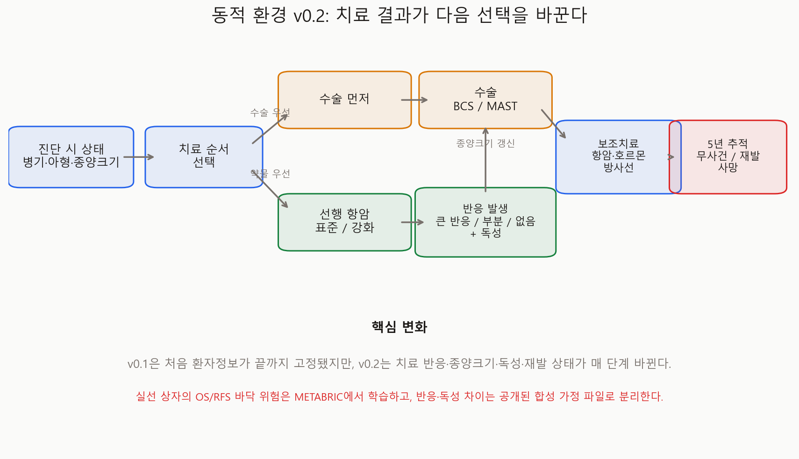
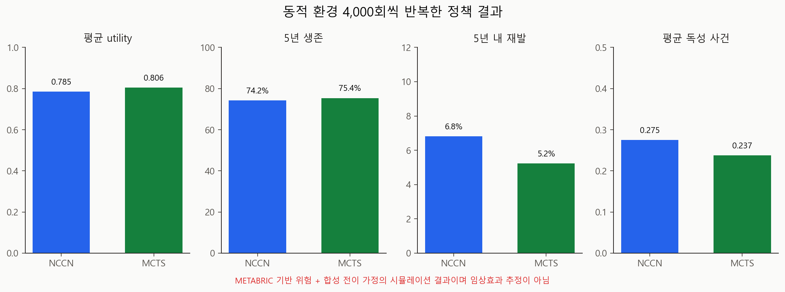
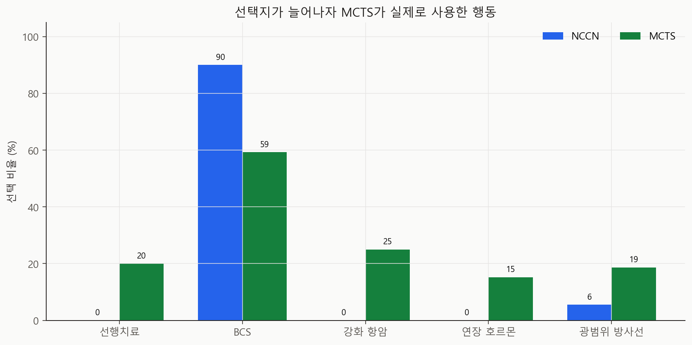
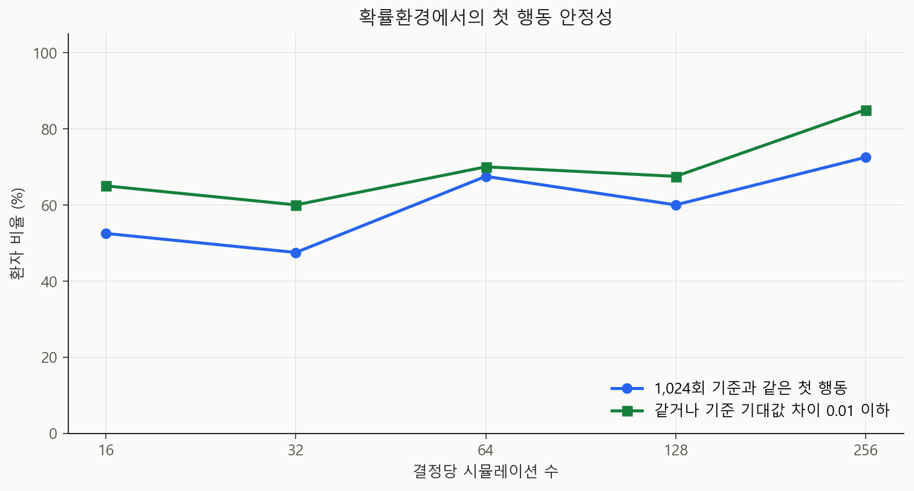

# Dynamic MCTS PoC v0.2 기술 보고서

- 실행일: 2026-07-11
- 데이터 기반 부분: METABRIC 환자 특성, 5년 OS/RFS Cox 위험
- 합성 부분: 치료 반응, 강도·범위 차이, 독성, utility 가중치
- 목적: 정적 치료조합 탐색을 상태가 변하는 확률환경으로 확장
- 금지된 해석: 실제 임상효과, 최신 치료 우월성, K-CURE 결과의 사전 추정

## 한 줄 결론

환자별 의사결정 궤적을 기존 8~16개에서 **18~135개**로 늘리고, 치료 반응에
따라 종양 크기와 다음 수술 선택지가 달라지는 5년 확률환경을 구현했습니다.
확률적 UCT-MCTS가 환경 안에서 재계획하는 것까지 작동했지만, 반응·독성 수치는
합성 가정이므로 이번 결과는 **동적 연구 파이프라인의 작동 시험**입니다.

## v0.1에서 무엇이 달라졌나

| 항목 | 정적 v0.1 | 동적 v0.2 |
|---|---|---|
| 환자 상태 | 처음 정보가 끝까지 고정 | 반응·종양크기·독성·재발·생존이 변화 |
| 치료 순서 | 수술부터 고정 | 수술 우선 / 선행치료 선택 |
| 항암 | No / Yes | None / Standard / Intensified |
| 호르몬 | No / Yes | None / Standard / Extended |
| 방사선 | No / Yes | None / Local / Regional |
| 결과 | Cox 5년 OS 점수 1개 | 매년 무사건·재발·사망 확률 전이 |
| 탐색 | 결정적 UCT | 확률 결과를 반복 샘플링하는 chance-aware UCT |



## 무엇이 데이터이고 무엇이 가정인가

### METABRIC에서 학습한 부분

- 1,955명의 OS 위험모형
- 1,951명의 RFS 위험모형
- 환자별 나이, 병기, 종양 크기, 림프절, 등급, HR/HER2 아형
- 실제 수술·항암·호르몬·방사선과 추적 결과의 관찰 연관성

### 합성 가정인 부분

- 선행치료 반응 확률: major / partial / none
- standard와 intensified 치료의 차이
- local과 regional 방사선의 차이
- 치료별 급성 독성 확률과 부담 점수
- 재발 후 사망위험 배수
- 생존·무재발·독성을 합친 utility 가중치

모든 합성값은 `configs/dynamic_poc_v0_2.json`에 모아 두었습니다. 코드는 이
값을 숨겨서 사용하지 않으며, `assumptions_snapshot.json`이 실행 시점의 설정을
보존합니다.

## 상태와 행동

### 환자 공통 스키마

`PatientProfile`은 데이터셋 이름과 무관하게 아래 11개 필드를 사용합니다.

| 범주 | 필드 |
|---|---|
| 식별·인구학 | patient_id, age, menopause |
| 종양 | tumor_size_mm, lymph_pos, stage, grade |
| 생체표지자 | subtype, er, pr, her2 |

현재는 METABRIC adapter가 이 형식으로 바꾸며, 향후 K-CURE adapter도 동일한
형식으로 출력하면 환경 코드를 변경하지 않고 재사용할 수 있습니다.

### 동적 상태

상태에는 현재 phase와 선택한 치료뿐 아니라 현재 종양 크기, 반응, 독성 횟수,
추적 연도, 재발·생존 상태가 들어갑니다. 선행 항암에서 major response가 나오면
종양 크기가 줄어 BCS가 새로 가능한 선택지가 될 수 있습니다.

### 환자별 action mask

- HR 음성: endocrine은 `none`만 허용
- 큰 종양 또는 높은 병기: BCS 제한
- 선행치료 부적격 저위험 상태: surgery-first만 허용
- 독성이 발생한 상태: extended endocrine 또는 regional radiation 제한

이는 완전한 임상 규칙이 아니라 v0.2의 안전한 연구용 제약입니다.

## 전이와 보상

완성된 치료를 기존 네 binary action으로 투영해 Cox 모형의 5년 OS/RFS를
가져옵니다. 이를 1년 단위 hazard로 바꿔 5년 동안 사망과 재발을 샘플링합니다.

한 해를 생존하면 보상을 받고, 재발 없이 생존하면 추가 보상을 받습니다. 치료
부담과 합성 독성이 발생하면 점수를 뺍니다. 최대 5년 무사건 생존을 1에 가깝게
정규화했습니다.

## 실험 설계

| 항목 | 값 |
|---|---:|
| 동적 평가 환자 | 40명 |
| 분자아형별 | 각 10명 |
| 정책별 환자당 episode | 100회 |
| 정책별 전체 episode | 4,000회 |
| MCTS 결정당 simulation | 256회 |
| 안정성 기준 search | 1,024회 |
| 고정 seed | 20260711 |

OS 보류 테스트 C-index는 `0.677`, RFS는 `0.649`였습니다. 두 모형 모두 외부
검증 전의 중간 수준 예측모형입니다.

## 결과

### 전체 정책 결과

| 지표 | NCCN형 기준 | 동적 MCTS | 차이 |
|---|---:|---:|---:|
| 평균 utility | 0.785 | 0.806 | +0.021 |
| 5년 생존 | 74.2% | 75.4% | +1.2%p |
| 5년 내 재발 | 6.8% | 5.2% | -1.6%p |
| 평균 독성 사건 | 0.275 | 0.238 | -0.037 |



이 차이는 임상효과가 아닙니다. MCTS가 합성 utility와 전이를 직접 최적화했기
때문에 그 환경 안에서 더 높은 점수가 나오는 것은 예상된 결과입니다.

### 선택한 행동

| 행동 | NCCN형 기준 | 동적 MCTS |
|---|---:|---:|
| 선행치료 | 0.0% | 20.0% |
| BCS | 90.0% | 59.3% |
| 강화 항암 | 0.0% | 25.0% |
| 연장 호르몬 | 0.0% | 15.2% |
| 광범위 방사선 | 5.5% | 18.7% |



새 행동을 실제로 사용했다는 것은 환경과 action mask가 작동한다는 뜻일 뿐,
그 행동이 임상적으로 더 좋다는 뜻은 아닙니다.

### 확률적 탐색 안정성

256회 search의 첫 행동은 1,024회 기준과 72.5% 같았습니다. 기준 search에서
두 행동의 기대값 차이가 `0.01` 이하인 사실상 동률 환자까지 포함하면 85.0%입니다.
정적 v0.1보다 불확실성이 큰 것이 정상이며, 다음 버전에는 반복 seed 평균과
confidence interval이 필요합니다.



## K-CURE로 옮길 때의 구조

환경은 다음 세 층으로 분리했습니다.

```text
데이터 adapter       METABRIC -> 공통 PatientProfile <- K-CURE
위험·전이 추정       현재 Cox + 합성 가정 -> 향후 K-CURE 실제 추정
MCTS 환경·탐색       데이터셋과 무관하게 그대로 재사용
```

K-CURE에서는 단순히 환자 수만 늘리는 것이 아니라 치료 시작일, 약제/용량,
반응평가일, 독성, 재발일, 사망일을 이용해 합성 가정을 실제 전이 추정으로
교체하는 것이 핵심입니다. 구체적인 필드 계획은 `docs/k-cure-adaptation.md`에
정리했습니다.

## 파일 안내

| 파일 | 역할 |
|---|---|
| `analysis/dynamic/schema.py` | 공통 환자·상태 스키마 |
| `analysis/dynamic/environment.py` | 상태, action mask, 확률 전이, 보상 |
| `analysis/dynamic/search.py` | stochastic chance-aware UCT |
| `analysis/dynamic/policies.py` | NCCN형 기준과 cached MCTS 정책 |
| `analysis/dynamic/evaluation.py` | episode 실행과 trace |
| `configs/dynamic_poc_v0_2.json` | 합성 가정 원본 |
| `analysis/08_run_dynamic_mcts_poc.py` | OS/RFS 학습과 정책 실험 |
| `analysis/09_visualize_dynamic_mcts_poc.py` | Figure 14~17 생성 |
| `tables/policy_episodes.csv` | 8,000개 episode 전체 결과 |
| `tables/example_traces.csv` | 아형별 실제 상태 변화 예시 |

## 재현 명령

```powershell
py analysis\08_run_dynamic_mcts_poc.py
py analysis\09_visualize_dynamic_mcts_poc.py
py -m unittest discover -s tests -v
```

## 다음 단계

1. 합성 transition 값 전체에 대한 민감도 분석
2. MCTS를 여러 seed로 반복해 action confidence interval 계산
3. target trial 명세와 치료별 인과효과 추정
4. K-CURE 변수사전 확정 후 adapter 작성
5. K-CURE의 실제 날짜·반응·독성으로 synthetic config 교체
6. 임상 자문을 통한 eligibility와 utility 검토

## 참고문헌

- NCI. [Breast Cancer Treatment](https://www.cancer.gov/types/breast/treatment).
- Kocsis L, Szepesvari C. [Bandit Based Monte-Carlo Planning](https://doi.org/10.1007/11871842_29). ECML, 2006.
- Cox DR. [Regression Models and Life-Tables](https://doi.org/10.1111/j.2517-6161.1972.tb00899.x). JRSS B, 1972.
- Curtis C, et al. [METABRIC original study](https://doi.org/10.1038/nature10983). Nature, 2012.
- Hernan MA, Robins JM. [Using Big Data to Emulate a Target Trial](https://doi.org/10.1093/aje/kwv254). AJE, 2016.

