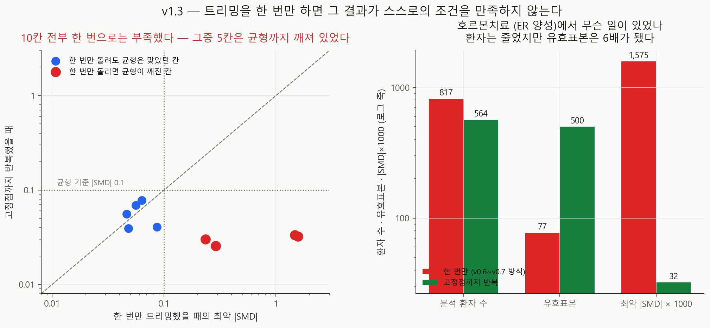
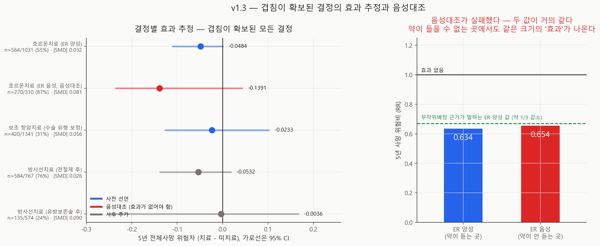

# 겹침이 확보된 결정의 효과 추정과 음성대조 — v1.3

- 실행일: 2026-09-05
- 입력: `data/processed/patients_with_nccn.csv`
- 핵심 코드: `analysis/31_run_endocrine_effect.py`, `analysis/32_visualize_endocrine_effect.py`
- 용도: v0.7이 "가장 답할 수 있는 결정"으로 꼽고 추정하지 않은 **호르몬치료**의 효과 추정,
  그리고 **약이 들을 수 없는 곳에서 같은 추정을 돌려보는 음성대조**
- 금지된 해석: 실제 치료 권고, MCTS vs NCCN 전략 비교

## 한 줄 결론

**음성대조가 실패했다.** 호르몬치료가 들을 수 없는 **ER 음성** 환자에서도 ER 양성과
**거의 같은 크기의 '효과'** 가 나왔다 — 위험비 **0.634**(ER 양성) 대 **0.654**(ER 음성).
따라서 ER 양성의 추정치가 무작위배정 근거(약 1/3 감소)와 잘 맞는다는 사실은
**우리가 효과를 복원했다는 증거가 되지 못한다.** 같은 파이프라인이 효과가 없는 곳에서도
같은 답을 내놓기 때문이다.

그리고 그 분석을 하려다 **우리 트리밍이 v0.6부터 미수렴 상태였다는 것**을 찾았다.
한 번의 trim-then-refit은 고정점이 아니어서, 남은 집단이 자기 자신의 겹침 조건을
만족하지 않는다. 10개 칸 전부가 그랬고, **5개 칸은 균형까지 깨져 있었다.**

## 추정 대상 (estimand)

> 각 결정의 propensity 겹침 구간(propensity ∈ [0.10, 0.90])에서, 치료군 대 비치료군의
> **5년 전체사망 위험차**. 분석 모집단은 트리밍으로 정의되므로 결정마다 다르다.

## 식별 가정

| 가정 | 이 분석에서 |
|---|---|
| 교환가능성 | 측정된 기저 공변량 + **수술 유형**에 조건부. 미측정 교란은 E-value로만 다룬다 |
| Positivity | 가정하지 않고 **트리밍으로 강제**한다. 이번에 그 강제가 미완이었음을 발견 |
| 일관성 | 치료마다 한 가지 버전. METABRIC에는 약제·용량·기간이 없다 |
| 검열 | 공변량·치료 의존 이산시간 위험(IPCW)으로 모형화 |

## 사전 선언한 예측 (실행 전 코드에 기록)

`metrics.json`의 `prespecified_prediction`에 그대로 있다.

| # | 예측 | 결과 |
|---|---|---|
| 1 | ER 양성에서 위험차가 **음수**(보호적) | **적중** (−0.0484) |
| 2 | ER 음성(음성대조)의 95% 구간이 **0을 포함** | 형식상 적중 — **아래 참조** |
| 3 | 항암치료가 v0.7 구간 [−0.1354, +0.0630] 안에 머문다 | **적중** (−0.0233) |

**예측 2의 기준을 잘못 잡았다.** "구간이 0을 포함"은 n=270에서 거의 자동으로 통과하는
기준이다(구간 폭 0.28). 실제로 통과했지만, **점추정 −0.1391은 주 분석(−0.0484)보다
2.9배 크다.** 기준을 "음성대조의 크기가 주 분석보다 작다"로 잡았어야 했다. 사후에
기준을 바꾸지 않고, **잘못 고른 기준을 그대로 남기고 실질 판정을 따로 적는다.**

## 먼저: 트리밍이 고정점이 아니었다



`trim_to_overlap`은 전체에서 propensity를 적합해 [0.10, 0.90] 밖을 잘라내고, 남은
집단에서 **다시 적합**한다. 재적합은 필요하다 — 전체 코호트에서 적합한 모형은 거의
결정적인 꼬리에 지배되기 때문이다. 그런데 **재적합이 만든 새 점수가 다시 창 밖으로
나갈 수 있다.** v0.6·v0.7은 이 과정을 **한 번만** 돌렸다.

| 칸 (결정 × 공변량 세트 × 모집단) | 값 |
|---|---:|
| 한 번으로 고정점에 도달한 칸 | **0 / 10** |
| 한 번만 돌리면 균형이 깨져 있던 칸 | **5 / 10** |

가장 심한 곳이 이번 주 분석이다.

| 호르몬치료 (ER 양성) | 한 번만 | 고정점까지 (5회) |
|---|---:|---:|
| 분석 환자 | 817 (79.2%) | **564 (54.7%)** |
| 창 안에 있는 비율 | 81.0% | **100%** |
| 최악 \|SMD\| | **1.575** | **0.032** |
| 균형 통과 공변량 | 10.0% | **100%** |
| 유효표본 | 77 | **500** |

**환자는 줄었지만 유효표본은 6.5배가 됐다.** 한 번만 돌린 집단은 소수의 극단 가중치가
지배하고 있었다(최대 가중치 94 → 3.4).

### 이것이 v0.6·v0.7을 어떻게 바꾸나

| 결론 | 판정 |
|---|---|
| 항암치료 위험차 −0.0319, CI가 0 포함 | **유지** — 고정점에서 −0.0233, v0.7 구간 안 |
| 세 추정량이 CI 폭의 3% 안에서 일치 | **유지** — 이번 항암 arm에서도 spread 0.0134 |
| 방사선의 넓은 겹침은 **누락 교란요인의 산물** | **유지** — 수술 유형을 넣으면 96% → 54%로 붕괴 |
| 방사선은 **식별 불가** | **철회** — 고정점까지 트리밍하면 \|SMD\| 0.234 → **0.030**, 100% 균형 |

즉 v0.7의 **교훈은 살아남았고 판정 하나가 뒤집혔다.** 방사선치료는 답할 수 있는
결정이며, 이 리포트가 그 답을 낸다.

`analysis/17`은 **한 번 패스로 고정**해 뒀다(`TRIM_ITERATIONS = 1`). v0.7 리포트가
자기 매니페스트로 그대로 재현되어야 하기 때문이며, `configs/dynamic_poc_v0_2.json`을
남겨 둔 것과 같은 이유다. 새 분석은 전부 고정점 트리밍을 쓴다.

## 결과



| 결정 | 분석 n (유지율) | 최악 \|SMD\| | 위험차 | 95% CI | RR | E-value |
|---|---:|---:|---:|---|---:|---:|
| **호르몬 (ER 양성)** 〔사전〕 | 564/1031 (54.7%) | 0.032 | **−0.0484** | [−0.1099, +0.0003] | 0.634 | 2.53 |
| **호르몬 (ER 음성)** 〔음성대조〕 | 270/310 (87.1%) | 0.081 | **−0.1391** | [−0.2350, +0.0429] | 0.654 | 2.43 |
| 항암 (수술 보정) 〔사전〕 | 420/1341 (31.3%) | 0.056 | −0.0233 | [−0.1264, +0.1018] | 0.909 | 1.43 |
| 방사선 (전절제 후) 〔사후〕 | 584/767 (76.1%) | 0.026 | −0.0532 | [−0.1376, +0.0182] | 0.779 | 1.89 |
| 방사선 (유방보존술 후) 〔사후〕 | 135/574 (23.5%) | 0.091 | −0.0036 | [−0.2516, +0.1670] | 0.956 | 1.27 |

방사선 두 arm은 **트리밍을 고친 뒤에 추가**한 것이므로 사후다. ER 상태로 호르몬을
가르는 것과 같은 이유로 수술 유형으로 갈랐다 — 유방보존술 후 방사선은 91.3%가 받는
**표준치료지 결정이 아니고**, 전절제 후(49.3%)가 실제로 갈리는 자리다. 그 예상대로
보존술 arm은 23.5%만 남고 구간이 ±0.2로 아무것도 말하지 못한다.

### 음성대조가 실패했다

| | ER 양성 (약이 듣는 곳) | ER 음성 (약이 안 듣는 곳) |
|---|---:|---:|
| 위험차 | −0.0484 | **−0.1391** |
| **위험비** | **0.634** | **0.654** |
| E-value | 2.53 | 2.43 |
| 무작위배정 근거의 기댓값 | 약 0.67 | **1.00** |

**상대 척도에서 두 값이 거의 같다.** 약이 들을 수 있는 곳과 들을 수 없는 곳에서
같은 크기의 '효과'가 나온다. 이것은 약의 효과가 아니라 **적응증에 의한 교란**이다 —
호르몬치료를 받은 환자가 받지 않은 환자보다 애초에 예후가 좋았다는 뜻이다.

ER 양성 추정치(RR 0.634 = 37% 감소)가 EBCTCG의 "약 1/3 감소"와 놀랄 만큼 잘 맞는데,
**그 일치는 근거가 되지 못한다.** 같은 파이프라인이 효과가 없는 곳에서 35% 감소를
만들어 내기 때문이다.

주의: 두 집단은 치료 비율(71.6% 대 26.8%)도 기저 위험(0.132 대 0.402)도 다르므로,
ER 음성의 편의 크기를 ER 양성에 그대로 대입할 수는 없다. 말할 수 있는 것은
**이 설계에 결과 방향으로 작동하는 상당한 교란이 남아 있다**는 것까지다.

E-value 2.53은 이 해석과 일관된다 — 치료와 결과 양쪽에 RR 2.5로 붙는 미측정 요인
하나면 ER 양성 추정치가 사라진다. 수행능력·동반질환·환자 선호처럼 METABRIC에 없는
변수들이 그 크기에 쉽게 닿는다.

## 무엇이 바뀌나

1. **관찰 추정치를 "효과"라고 부르지 않는다.** v1.3 이후 이 프로젝트의 인과 추정치는
   전부 **"교란 보정 후에도 남는 연관성"** 으로 적는다. 음성대조가 그 이유다.
2. **새 분석은 고정점 트리밍을 쓴다.** 수렴 여부(`converged`)를 metrics에 남기고,
   수렴하지 않으면 실행을 중단한다.
3. **방사선치료는 답할 수 있는 결정 목록에 들어간다.** v0.7의 "식별 불가" 판정을 철회한다.
4. **음성대조를 표준 절차로 넣는다.** 인과 추정을 낼 때마다 "효과가 없어야 하는 곳"을
   같이 돌린다. 없으면 그 추정치는 검증되지 않은 것으로 표기한다.
5. **K-CURE 변수 요청에 수행능력·동반질환을 최우선으로 올린다.** 음성대조가 실패한
   방향이 정확히 그 변수들이 메울 자리다.

## 한계 (심각도 순)

- **음성대조 실패가 주 결과다.** ER 양성의 −0.0484를 효과로 인용하면 안 된다.
- **음성대조 자체도 n=270**이라 구간이 넓다(폭 0.28). "편의가 −0.139다"가 아니라
  "상당한 편의가 있다"까지가 이 자료가 지지하는 진술이다.
- **ER 음성에서 호르몬치료를 받은 83명이 왜 받았는지 모른다.** PR 양성이거나, 당시
  관행이거나, 기록 오류일 수 있다. 그 이유가 예후와 얽혀 있다면 편의의 방향도 달라진다.
- **방사선 두 arm은 사후**다. 트리밍 수정이 없었으면 존재하지 않았을 분석이다.
- **단일 시점 결정**의 추정이며 MCTS vs NCCN 전략 비교가 아니다. 그 비교에는 여전히
  METABRIC에 없는 치료 시점이 필요하다.
- METABRIC은 1977~2005년 영국 코호트다.

## 다음 단계

1. utility 가중치 **공동 사전등록** ← 여전히 우선순위 최상, 사람 검토 대기
2. **K-CURE 변수 요청서에 수행능력·동반질환 추가** — 음성대조가 실패한 자리
3. 교란요인 목록 임상 검토 (v0.7) — 이제 근거가 둘이다(수술 유형 누락, 음성대조 실패)
4. K-CURE 확보 후 순차 전략 비교

## 산출물

| 파일 | 내용 |
|---|---|
| `metrics.json` | 사전 예측·판정·arm별 추정·트리밍 수렴 |
| `run_manifest.json` | 입력 SHA-256·시드·커밋 |
| `figures/fig36_endocrine_effect.png` | 결정별 효과와 음성대조 |
| `figures/fig37_trim_convergence.png` | 트리밍 미수렴과 그 영향 |
| `tables/arm_results.csv` | arm별 추정·CI·균형·E-value |
| `tables/covariate_balance.csv` | arm별 공변량 균형 (가중 전후 SMD) |
| `tables/estimator_comparison.csv` | arm × 추정량 3종 |
| `tables/trim_convergence.csv` | 10칸 × (한 번 / 고정점) |

## 재현

```powershell
py analysis\31_run_endocrine_effect.py
py analysis\32_visualize_endocrine_effect.py
```

## 참고문헌

- EBCTCG. Relevance of breast cancer hormone receptors and other factors to the
  efficacy of adjuvant tamoxifen. *Lancet*. 2011;378:771-84.
- EBCTCG. Effect of radiotherapy after mastectomy and axillary surgery on 10-year
  recurrence and 20-year breast cancer mortality. *Lancet*. 2014;383:2127-35.
- Lipsitch M, Tchetgen Tchetgen E, Cohen T. Negative controls: a tool for
  detecting confounding and bias. *Epidemiology*. 2010;21:383-8.
- Crump RK, et al. Dealing with limited overlap in estimation of average treatment
  effects. *Biometrika*. 2009;96:187-99.
- VanderWeele TJ, Ding P. Sensitivity analysis in observational research:
  introducing the E-value. *Ann Intern Med*. 2017;167:268-74.
