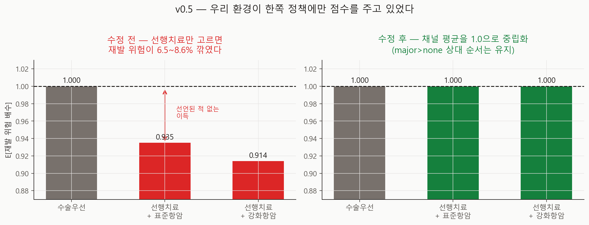

# 환경 편향 수정과 그 영향 v0.5 기술 보고서

- 실행일: 2026-08-27
- 입력: `data/processed/patients_with_nccn.csv` + `configs/dynamic_v0_5.json`
- 핵심 코드: `analysis/13_run_environment_fix_impact.py`
- 용도: 응답 채널의 구조적 편향을 제거하고, 그 편향이 기존 결론을 얼마나 부풀렸는지 측정
- 금지된 해석: 실제 임상효과, 인과효과, 최신 치료 우월성

## 한 줄 결론

환경이 **선행치료를 고르기만 하면 재발 위험을 6.5~8.6% 깎아주고 있었다.** 어떤 가정에도
적혀 있지 않은 이득이었다. 수정했고, 수정 전후 결과 차이는 측정 한계 안이었다.
다만 이 음성 결과는 **"영향이 없었다"가 아니라 "이 설계로는 볼 수 없는 크기였다"** 이다.
수정의 근거는 측정된 크기가 아니라 **타당성**이다.

## 무엇이 잘못돼 있었나



`response`(치료 반응)는 **선행치료를 고른 환자만 뽑는다.** 수술우선 환자는 반응을 측정할
대상이 없으니 영원히 `not_applicable`이고, 그 hazard 배수는 1.0으로 고정된다. 여기까지는
임상적으로 자연스럽다.

문제는 **응답 배수의 기댓값이 1.0이 아니었다**는 것이다.

| 경로 | E[사망 위험 배수] | E[재발 위험 배수] |
|---|---:|---:|
| 수술우선 | 1.000 | **1.000** |
| 선행치료 + 표준항암 | 0.990 | **0.935** |
| 선행치료 + 강화항암 | 0.984 | **0.914** |

계산은 단순하다. 표준항암의 반응분포(major 0.25 / partial 0.50 / none 0.25)에
재발 배수(0.80 / 0.92 / 1.10)를 곱해 더하면 0.935다. 그래서 선행치료를 고른 것만으로
재발 위험이 평균 6.5% 깎였다.

같은 계획, timing만 다른 환자의 연간 사건 확률로 보면:

| chemo | timing | P(사망) | P(재발) |
|---|---|---:|---:|
| standard | surgery_first | 0.03891 | 0.01769 |
| standard | neoadjuvant | 0.03853 | 0.01655 |
| | **차이** | **−0.98%** | **−6.46%** |
| intensified | surgery_first | 0.03700 | 0.01593 |
| intensified | neoadjuvant | 0.03640 | 0.01457 |
| | **차이** | **−1.62%** | **−8.55%** |

**설정 파일 어디에도 "선행치료는 재발을 8% 줄인다"고 적혀 있지 않다.** 그런데 환경은
그렇게 작동하고 있었다. 이것은 선언되지 않은 임상 가정이며, 따라서 v0.3 민감도 분석의
대상도 되지 못했다.

## 왜 이것이 성능 문제가 아니라 최우선 결함인가

이 프로젝트의 질문은 **"NCCN 가이드라인이 최적인가"** 이고, 산출물은 *이기는 MCTS*가
아니라 **믿을 수 있는 비교**다. 한쪽 정책에만 붙는 이득이 있으면 MCTS가 이겨도 져도
질문에 답할 수 없다. 성능 저하는 결과를 약하게 만들지만 편향은 결과를 **무효로** 만든다.

그리고 이 편향은 정확히 한쪽에만 붙었다. NCCN 정책은 항상 수술우선을 택하므로
**반응을 뽑는 일이 없다.** 아래 측정에서 NCCN 효용이 두 환경에서 소수점까지 동일한 것이
그 증거다.

## 어떻게 고쳤나

채널을 **지우지 않고 중립화**했다. 뽑힌 배수를 그 반응분포에서의 기댓값으로 나눈다.

```
배수_적용 = 배수[response] / E[배수 | 그 항암강도의 반응분포]
```

- `major > partial > none` 이라는 **상대 순서는 그대로 유지**된다 (반응이 좋으면 예후가
  좋다는 것은 관찰 사실이다).
- 채널 **평균만 1.0**이 되어, 선행치료를 고르는 행위 자체는 더 이상 이득을 주지 않는다.
- 선행치료의 실제 이득이 있다면 새로 만든 명시적 `hazard_multipliers.timing` 채널에
  넣는다. 그래야 민감도 분석이 볼 수 있다. 현재는 근거가 없으므로 1.0(중립)이다.

수정 후 같은 계산을 하면 두 timing의 차이는 **−0.01%** 로, hazard→확률 변환의 볼록성에서
오는 잔차만 남는다.

`response_channel_neutralised` 스위치로 **선언**했다. 기본값은 True이고, False로 두면
v0.2~v0.4가 돌던 편향 동작이 그대로 재현된다. 편향의 크기를 변수 하나만 바꿔 측정하기
위해서다. 회귀 테스트가 양쪽을 모두 고정한다.

## 이 편향이 기존 결론을 얼마나 부풀렸나

같은 환자 12명·같은 시드 10개·같은 예산(1024)에서 편향/수정 두 환경을 돌리고 시드 내에서
짝지어 비교했다.

| 지표 | 편향 | 수정 | 짝지은 차이 95% CI | 0 포함 |
|---|---:|---:|---:|---|
| 효용 격차 (MCTS−NCCN) | +0.0314 | +0.0313 | [−0.0100, +0.0099] | 예 |
| 5년 생존 격차 | +2.13%p | +1.87%p | [−1.70, +1.17] | 예 |
| MCTS 선행치료율 | 20.8% | 21.7% | [−10.7, +12.4] | 예 |
| MCTS 강화항암율 | 12.4% | 10.8% | [−8.07, +4.87] | 예 |
| MCTS 독성 | 0.178 | 0.172 | [−0.030, +0.017] | 예 |
| **NCCN 효용** | **0.789625** | **0.789625** | **정확히 0** | — |

**어떤 지표도 잡음을 넘지 못했다.** 그리고 NCCN 효용이 완전히 동일한 것은 설계 검증이다 —
편향이 MCTS 갈래에만 붙었다는 이론이 그대로 확인됐다.

## 이 음성 결과를 어떻게 읽어야 하나

**"영향이 없었다"로 읽으면 틀린다.** 아무것도 못 찾은 실험은 "효과가 없다"가 아니라
"우리가 분해할 수 있는 것보다 작다"를 보여줄 뿐이다. 그래서 편향의 이론적 크기를 따로
계산해 `metrics.json`에 함께 기록했다.

MCTS가 선행치료를 고르는 episode는 20.8%뿐이고, 그 20.8%에서만 연간 재발확률이
0.01769 → 0.01654로 내려간다. 5년치를 합치면 재발 없는 해가 0.0165년 늘어나고, 이를
효용으로 환산하면:

| 값 | 크기 |
|---|---:|
| 편향이 만들어내는 기대 격차 부풀림 | **0.000229** |
| 이 설계가 분해할 수 있는 최소 차이 (95% CI 반폭) | **0.009942** |
| 비율 | **43배 부족** |

즉 **이 실험은 애초에 그 크기를 검출할 수 없었다.** `metrics.json`의
`analytic_effect_estimate.design_is_powered_for_it`이 `false`인 이유다. 이 값을 지표로
남긴 것은, 나중에 누군가 이 음성 결과를 "문제없음"의 근거로 인용하는 것을 막기 위해서다.

CI 반폭은 1/√n 로 줄므로, 이 크기를 검출하려면 시드가
`10 × (0.009942 / 0.000229)² ≈ 18,800`개 필요하다. 현실적이지 않고 **그럴 필요도 없다.**
편향의 크기는 시뮬레이션이 아니라 산술로 이미 정확히 알고 있기 때문이다.

따라서 이 보고서가 주장하는 것은 다음 두 가지뿐이다.

1. 편향은 **실재했고** 그 크기는 산술로 정확히 특정된다 (재발 위험 −6.5~−8.6%).
2. 현재 코호트·현재 가정에서 그 편향이 헤드라인 수치를 눈에 띄게 움직였다는 증거는 없고,
   **동시에 움직이지 않았다는 증거도 없다.**

## 그래도 수정을 유지하는 이유

1. **타당성은 크기와 무관하다.** 선언되지 않은 이득이 있으면 비교 자체가 성립하지 않는다.
2. **크기는 코호트에 따라 달라진다.** 지금은 선행치료 선택률이 21%라 작았다. 진행성 병기나
   TNBC 비중이 높은 코호트, 또는 선행치료 적응증이 넓은 설정에서는 훨씬 커진다.
3. **가정이 바뀌면 커진다.** v0.3 민감도에서 `response.intensified.major`는 영향 3위
   가정이었다. K-CURE 추정치로 교체하면 이 채널의 무게가 달라진다.
4. **이제 민감도 분석의 대상이 된다.** 선행치료 효과가 `timing` 채널로 나왔으므로,
   앞으로는 흔들어 볼 수 있는 값이 되었다.

## 함께 고친 것 — 할인율 명시

지금까지 코드는 할인 없이(γ=1) 돌고 있었다. 이는 **"1년차 생존과 5년차 생존의 가치가
같다"** 고 암묵적으로 선언한 것과 같은데, 어디에도 적혀 있지 않았다. 보건경제 관행은
연 3% 할인이다.

`discount_rate_annual`을 설정에 넣었다. 기본값 0.0으로 **동작은 그대로 두되**, 이제
선언된 값이므로 민감도 분석에서 3%로 올려 볼 수 있다. 치료를 지연시키는 선택(선행치료)의
평가가 여기 영향을 받으므로 다음 민감도 격자에 포함해야 한다.

## 아직 안 고친 것

- **연간 위험이 상수다(지수분포 가정).** Cox의 비모수 baseline hazard를 5년 생존률 하나로
  압축했다가 `-log(S)/5`로 되돌린다. 유방암은 재발 위험의 시간 형태가 아형별로 다른
  대표적 암인데(TNBC 초기 집중, HR+ 늦은 재발) 그 형태가 지워진다. K-CURE 실제 생존곡선
  단계에서 함께 고칠 항목이다.
- **rollout이 균등 무작위다.** v0.4에서 측정한 top action 방문 점유율이 47.2%로 거의
  균등 탐색 중이다. NCCN 정책 rollout으로 바꾸면 분산이 크게 준다.
- **완전관측 MDP 가정.** 실제 임상은 POMDP다. 학부 PoC 범위에서 타당한 단순화지만
  한계로 명시해 둔다.

## 검증한 다른 가설들 (모두 기각)

v0.4의 "동률" 결론이 알고리즘 튜닝 탓일 수 있어 두 가지를 실측했다.

| 가설 | 결과 |
|---|---|
| 탐색상수 c=√2가 gap 0.02 대비 과대 | c를 0~1.41로 쓸어도 일치율 47% 근처 평평. c를 낮추면 추정 잡음이 0.031 → 0.20으로 **악화** |
| robust child(방문수) 대신 max child(가치)로 뽑으면 개선 | 62.8% vs 62.4%로 **차이 없음** |

두 대안 설명이 모두 배제되어, v0.4의 동률 결론은 오히려 단단해졌다.

## 산출물

| 파일 | 내용 |
|---|---|
| `metrics.json` | 편향 명세·짝지은 효과·**검정력 계산** |
| `run_manifest.json` | 입력 SHA-256·base seed·실행 커밋 |
| `figures/fig22_response_channel_bias.png` | 편향 전/후 응답 채널 기댓값 |
| `figures/fig23_results_reconciliation.png` | 헤드라인 수치 다섯 값의 화해 |
| `tables/per_seed_by_arm.csv` | 시드×환경별 원자료 |
| `tables/paired_effect_of_fix.csv` | 지표별 짝지은 차이와 95% CI |

## 재현

```powershell
py analysis\13_run_environment_fix_impact.py
py -m unittest tests.test_dynamic_environment -v
```

편향의 크기 자체는 시뮬레이션 없이 산술로 확인할 수 있다.

```powershell
py -c "import sys; sys.path.insert(0,'.'); from analysis.dynamic.config import load_dynamic_config; c=load_dynamic_config('configs/dynamic_v0_5.json'); print({i: round(c.response_multiplier_mean(i,'recurrence'),4) for i in ('standard','intensified')})"
```
