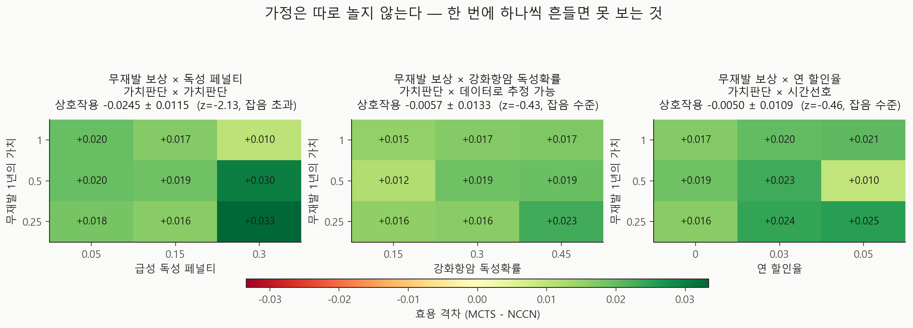

# 2차원 상호작용 민감도 v0.8

- 실행일: 2026-08-28
- 입력: `data/processed/patients_with_nccn.csv` + `configs/dynamic_v0_5.json`
- 핵심 코드: `analysis/19_run_interaction_sensitivity.py`, `analysis/20_visualize_interaction.py`
- 금지된 해석: 실제 임상효과, 인과효과, 최신 치료 우월성

## 한 줄 결론

> ⚠️ **정정 (2026-08-28, v0.9)** — 아래의 "방향이 뒤집힌다"는 결론은
> **시드 12개 확인 실험에서 지지되지 않았다.** 상호작용은 −0.0245에서 −0.0115로
> 절반이 되고 z는 −2.13 → −1.63으로 잡음 기준 아래로 내려갔으며, 부호 반전 자체가
> 사라졌다(두 보상 수준 모두 +0.0129, +0.0013로 같은 방향). 승자의 저주 사례다.
> 이 리포트는 그때 무엇을 보고했는지의 기록으로 남기며, 현재 값은
> [`reports/utility-interaction-v0.9`](../utility-interaction-v0.9/README.md)를 본다.
> 여전히 유효한 것: 두 가치판단이 **각각** 격차를 크게 움직인다는 점.

두 가치판단은 **따로 놀지 않는다.** 무재발 보상이 낮을 때 독성 페널티를 올리면 MCTS 우세가
**커지고**(+0.0153), 높을 때 올리면 **작아진다**(−0.0092). 방향이 뒤집힌다. 다만 이 상호작용은
시드 잡음의 약 2배(z = −2.13)라 **따라가 볼 신호이지 확정된 결과가 아니다.** 나머지 두 격자
(임상 파라미터·할인율)는 잡음 수준이었다.

## 추정 대상 (estimand)

> 수정된 v0.5 환경에서, 두 가정을 **동시에** 바꿨을 때의 평균 MCTS−NCCN 효용 격차.

우리 시뮬레이터가 자기 가정에 얼마나 민감한지를 재는 값이며, 어떤 실제 양의 추정치도 아니다.

## 왜 이 분석을 했나

v0.3은 가정을 **하나씩** 흔들어 순위를 매겼다. 그 분석은 "어느 가정이 가장 중요한가"에는
답하지만 **"A의 효과가 B에 따라 달라지는가"** 는 보지 못한다. 만약 순위 1·2위였던 두
가치판단이 서로를 강화한다면, 우리 헤드라인 수치의 정직한 불확실성 폭은 일차원 분석이
보여준 것보다 넓다.

세 격자를 돌렸다. x축은 모두 v0.3이 1위로 꼽은 가치판단(무재발 1년의 가치)이라 서로 비교된다.

| 격자 | y축 | 성격 |
|---|---|---|
| 가치판단 × 가치판단 | 급성 독성 페널티 | 둘 다 우리가 고르는 값 |
| 가치판단 × 임상 | 강화항암 독성확률 | K-CURE로 추정 가능한 값 |
| 가치판단 × 시간선호 | 연 할인율 | v0.5에서 처음 선언 가능해진 축 |

## 설계

| 항목 | 값 |
|---|---:|
| 평가 환자 | 8명 (분자아형별 2명) |
| 시드 | 3 |
| 시드·정책당 episode | 30 |
| 탐색 예산 | **1024** (v0.4 규약) |
| 격자 | 3개 × 3×3 = **27 셀** |
| 셀당 시드 표준오차 | 평균 0.0043~0.0059 |

> **절대값 주의**: 표본이 8명·3시드라 기준 근처 셀(+0.0189)은 12명·10시드 실행(+0.0313)과
> 직접 비교할 수 없다. v0.3 민감도가 그랬듯 **셀 간 상대 변화로 읽어야 한다.**

## 결과



### 가치판단 × 가치판단 — 방향이 뒤집힌다

| 무재발 보상 ↓ / 독성 페널티 → | 0.05 | 0.15 | 0.30 |
|---|---:|---:|---:|
| 0.25 | +0.0181 | +0.0163 | **+0.0334** |
| 0.50 | +0.0198 | +0.0189 | +0.0302 |
| 1.00 | +0.0196 | +0.0167 | **+0.0104** |

독성 페널티를 0.05 → 0.30으로 올렸을 때:

- 무재발 보상 **0.25**에서는 격차가 **+0.0153 커진다**
- 무재발 보상 **1.00**에서는 격차가 **−0.0092 작아진다**

차이-의-차이 **−0.0245 ± 0.0115 (z = −2.13)**. 가법모형 잔차는 격자 전체 범위의 **41%**다.

읽는 법은 이렇다. 무재발을 낮게 치면 MCTS의 우세는 주로 **독성을 피하는 데서** 나오므로
독성 페널티를 키울수록 유리해진다. 무재발을 높게 치면 MCTS는 재발 방지 쪽으로 움직이는데,
그 경로가 더 독한 치료를 쓰므로 독성 페널티가 커질수록 손해를 본다. **같은 파라미터가 다른
가치 설정에서 반대로 작용한다.**

### 가치판단 × 임상, 가치판단 × 시간선호 — 잡음 수준

| 격자 | 차이-의-차이 | 표준오차 | z | 판정 |
|---|---:|---:|---:|---|
| 가치판단 × 가치판단 | −0.0245 | 0.0115 | **−2.13** | 잡음 초과 |
| 가치판단 × 임상 | −0.0057 | 0.0133 | −0.43 | 잡음 수준 |
| 가치판단 × 시간선호 | −0.0050 | 0.0109 | −0.46 | 잡음 수준 |

할인율은 0%에서 3~5%로 올려도 격차를 크게 움직이지 않았다(범위 0.0156). **v0.2~v0.4가
할인 없이 돈 것은 결과를 왜곡하지 않았다**는 뜻이지만, 이 격자의 검정력으로는 작은 효과를
배제할 수 없다.

### 부호 반전이 사라졌다

27개 셀 **전부 양수**였다(최소 +0.0098, 최대 +0.0334). v0.3 민감도는 부호 반전을 보고했고
v0.5env 재실행도 여전히 그렇다.

차이는 **탐색 예산**이라고 여기서 썼으나, **v1.0에서 이 설명이 틀렸음이 드러났다.**
시드 12개로 돌리면 **256 예산에서도** 부호 반전이 사라진다. 원인은 예산이 아니라
**정밀도**였다 — v0.3의 3시드가 기준선을 0.019 낮게 잡고 있었다.
[`reports/sensitivity-precision-v1.0`](../sensitivity-precision-v1.0/README.md) 참고.

다만 이것을 "부호 반전이 없다"로 읽으면 안 된다. 이 격자는 6개 가정 중 3개만, 그것도
제한된 범위에서 흔들었다.

## 무엇이 바뀌나

1. **utility 가중치는 하나씩이 아니라 함께 사전등록해야 한다.** 무재발 보상과 독성
   페널티를 따로 정하면, 한쪽을 정하는 순간 다른 쪽의 방향이 달라진다.
2. **v0.3의 tornado 순위는 크기만 말하고 방향은 말하지 못한다.** 순위 자체는 v0.5env
   재실행에서도 유지되지만, "이 가정을 올리면 격차가 커진다"는 서술은 다른 가정을
   고정해야만 성립한다.
3. **할인율 채택 여부의 우선순위는 낮출 수 있다.** 이 범위에서는 결론을 바꾸지 않았다.

## 한계

- **시드 3개다.** 유일하게 잡음을 넘은 상호작용도 z = −2.13에 그친다. 확정하려면 시드를
  늘려야 한다(같은 정밀도로 z를 두 배 키우려면 시드 12개).
- **표본 8명.** 격자 27셀을 감당하려는 선택이었고, 절대 수준은 다른 실행과 비교 불가다.
- **3개 가정만, 3점 격자로** 흔들었다. 6개 가정의 전체 상호작용 구조는 보지 않았다.
- 여전히 합성 가정 위의 값이다. 실제 임상효과가 아니다.
- 격자 값과 축 범위는 v0.3의 일차원 분석에서 쓰던 것을 그대로 가져왔다. **사후에 고른
  범위가 아니지만, 3점은 곡률을 보기엔 성기다.**

## 다음 단계

1. 가치판단 × 가치판단 격자를 **시드 12개**로 재실행해 상호작용을 확정하거나 기각
2. utility 가중치 **공동 사전등록** — 문헌 QALY·환자선호 기반, 두 값을 한 쌍으로
3. 임상 검토: 무재발 1년과 급성 독성의 상대 가치를 임상의·환자가 어떻게 두는가
4. K-CURE 확보 후 임상 파라미터를 실제 추정치로 교체

## 산출물

| 파일 | 내용 |
|---|---|
| `metrics.json` | 격자별 상호작용 통계·표준오차·z |
| `run_manifest.json` | 입력 SHA-256·base seed·실행 커밋 |
| `figures/fig29_interaction_surfaces.png` | 격자 3종 히트맵 |
| `tables/interaction_grid.csv` | 27개 셀 전체 결과 |
| `tables/interaction_summary.csv` | 격자별 요약 |

## 재현

```powershell
py analysis\19_run_interaction_sensitivity.py
py analysis\20_visualize_interaction.py
```

## 참고문헌

- Saltelli A, et al. *Global Sensitivity Analysis: The Primer*. Wiley. 2008.
- Briggs AH, et al. Model parameter estimation and uncertainty analysis
  (ISPOR-SMDM Modeling Good Research Practices Task Force-6).
  *Med Decis Making*. 2012.
