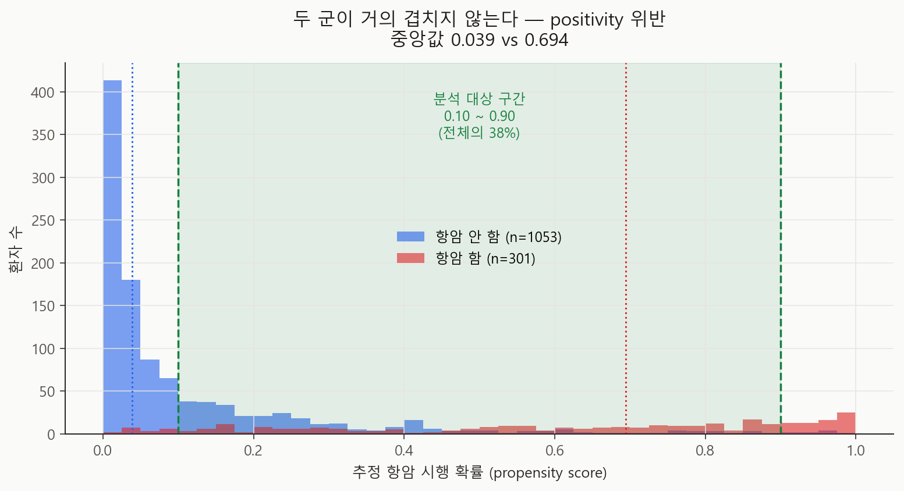
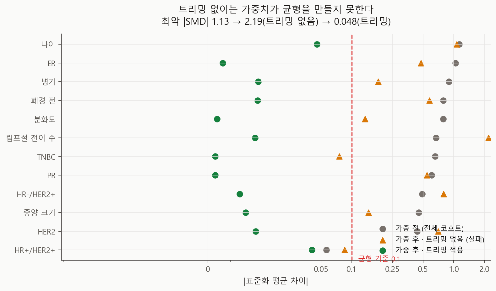
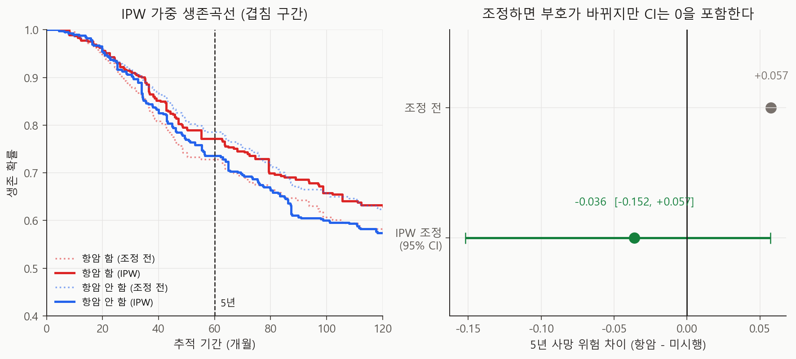

# IPW 표적시험 에뮬레이션 v0.6 기술 보고서

- 실행일: 2026-08-27
- 입력: `data/processed/patients_with_nccn.csv`
- 프로토콜: `docs/target-trial-protocol.md`
- 핵심 코드: `analysis/15_run_ipw_target_trial.py` (모듈 `analysis/causal/ipw.py`)
- 용도: 관찰 연관성을 인과추정치로 바꾸는 **기계장치를 한 결정 지점에서 시험**
- 금지된 해석: MCTS vs NCCN 전략 비교의 인과효과, 최신 진료에 대한 권고

## 한 줄 결론

**데이터가 질문을 감당하지 못한다.** 전체 코호트에서 항암 시행 여부는 나이·수용체·림프절만
알면 거의 결정되어 있었고(대조군 propensity 중앙값 0.039 vs 치료군 0.694), **가중치를
적용하면 균형이 오히려 나빠졌다**(최악 |SMD| 1.13 → 2.19). 결정이 실제로 불확실했던
**겹침 구간 38%로 좁히자 비로소 전 공변량이 균형**을 이뤘고, 그 안에서 항암은 5년 사망을
낮추는 방향이었으나 **신뢰구간이 0을 포함**했다(위험차 −0.036, 95% CI [−0.152, +0.057]).

## 이 분석이 답하는 질문과 답하지 않는 질문

`docs/target-trial-protocol.md`가 명세한 추정치는 **두 동적 치료전략(NCCN vs MCTS)의
비교**다. 그것은 시간의존 교란을 다루는 g-방법이 필요하고, METABRIC에는 **치료 시점
정보가 없어** 식별 자체가 불가능하다.

그래서 이 보고서는 지금 가능한 조각을 한다 — **단일 시점 결정 하나**(보조 항암치료
시행 여부)의 5년 전체생존 효과. 프로펜서티 모형·positivity·균형·가중 생존곡선·미측정
교란 민감도라는 **기계장치를 실제 데이터에서 돌려보는 것**이 목적이다.

**이것은 MCTS vs NCCN 인과 비교가 아니다.** 우리가 계산할 수 있는 것과 프로토콜이
요구하는 것 사이의 간극이, 이 보고서의 가장 중요한 결과다.

## 설계

| 항목 | 값 |
|---|---:|
| 적격 환자 | 1,354명 (교란요인·치료·결과 완전 케이스) |
| 항암 시행 | 301명 (22.2%) |
| 사망 사건 | 758건 |
| 결과 | 5년(60개월) 전체생존 |
| 교란요인 | 나이, 종양 크기, 림프절 전이 수, 병기, 분화도, ER, PR, HER2, 폐경, 분자아형 |
| 프로펜서티 모형 | ridge 로지스틱 (IRLS 직접 구현) |
| 가중치 | 안정화 IPT weight |
| 신뢰구간 | 부트스트랩 1,000회 (매 반복마다 모형 적합·트리밍 전 과정 반복) |

## 결과 1 — 문제는 교란이 아니라 positivity였다



| | 대조군 | 치료군 |
|---|---:|---:|
| propensity 중앙값 | **0.039** | **0.694** |

두 군이 겹치는 구간이 거의 없다. 젊고 ER 음성이며 림프절 전이가 많은 환자는 사실상 전원
항암을 받았고, 고령·ER 양성·림프절 음성 환자는 사실상 전원 받지 않았다. 이것은
**positivity 가정의 위반**이며, 교란 보정으로 해결되는 문제가 아니다.

실제로 전체 코호트에 가중치를 적용하자 **균형이 더 나빠졌다.**

| 전체 코호트 | 최악 \|SMD\| | 균형 달성 | 유효표본 |
|---|---:|---:|---:|
| 가중 전 | 1.133 | — | 1,354 |
| 가중 후 (트리밍 없음) | **2.191** | 17% | **24** |

유효표본이 1,354명에서 **24명**으로 붕괴한다. 소수의 극단 가중치가 추정치를 지배한다는
뜻이고, 이 상태의 어떤 결과도 보고할 수 없다.

## 결과 2 — 겹침 구간으로 좁히면 균형이 잡힌다



트리밍 기준은 **"모든 공변량을 균형시키는 가장 느슨한 구간"** 으로 정했고, 세 구간을 모두
보고한다.

| 트리밍 | n | 항암 | 최악 \|SMD\| | 균형 달성 | 유효표본 | 위험차 |
|---|---:|---:|---:|---:|---:|---:|
| [0.05, 0.95] | 706 | 251 | 0.229 | 92% | 227 | −0.075 |
| **[0.10, 0.90]** | **515** | **216** | **0.048** | **100%** | **309** | **−0.036** |
| [0.15, 0.85] | 399 | 179 | 0.040 | 100% | 276 | −0.030 |

**주 분석은 [0.10, 0.90]** 이다. 전체의 38%만 남는다.

> **추정 대상이 바뀐다.** 이제 이 값은 적격 코호트 전체가 아니라 **"항암 여부가 실제로
> 불확실했던 환자군"** 의 평균 처치효과다. 임상적으로는 오히려 흥미로운 모집단이지만
> — 이 프로젝트가 v0.4에서 찾은 "동률 구간"과 같은 성격이다 — 표적시험이 명세한
> 모집단은 아니다.

## 결과 3 — 조정하면 부호가 바뀐다. 다만 유의하지 않다



| 추정 | 항암군 5년 사망위험 | 대조군 | 위험차 | 위험비 |
|---|---:|---:|---:|---:|
| 조정 전 | 0.272 | 0.214 | **+0.057** | 1.268 |
| **IPW 조정** | 0.228 | 0.264 | **−0.036** | 0.864 |

95% CI: 위험차 **[−0.152, +0.057]**, 위험비 [0.546, 1.253].

조정 전에는 항암이 **해로워 보인다.** 겹침 구간 안에서도 더 나쁜 환자에게 항암이 갔기
때문이다(confounding by indication). 가중 후에는 방향이 뒤집혀 5년 사망위험이 3.6%p
낮아지는 쪽이 되지만, **신뢰구간이 0을 넉넉히 포함**한다.

부호가 뒤집힌 폭 자체(**+0.057 → −0.036, 총 0.093**)가 이 자료에 교란이 얼마나 심한지를
보여준다. 조정하지 않은 관찰 비교는 방향조차 믿을 수 없다.

## 미측정 교란에 대한 민감도

| E-value | 값 | 뜻 |
|---|---:|---|
| 점추정 | **1.59** | 미측정 교란요인이 치료·결과 양쪽과 위험비 1.59 이상으로 연관돼야 이 결과가 귀무로 간다 |
| 신뢰구간 | **1.00** | CI가 이미 귀무를 포함하므로 설명할 것이 없다 |

E-value 1.59는 크지 않다. 수행능력(performance status), 동반질환, 환자 선호 같은
**METABRIC에 없는 변수**가 이 정도 연관을 갖는 것은 충분히 있을 수 있다. 즉 점추정의
방향조차 미측정 교란으로 설명될 수 있다.

## 무엇을 배웠나

1. **기계장치는 작동한다.** 프로펜서티 모형은 계수를 회복하고, 가중치는 균형을 만들고,
   가중 KM은 손계산과 일치한다(단위 테스트 24종).
2. **데이터가 병목이다.** METABRIC으로는 이 한 결정조차 전체 모집단에서 식별할 수 없다.
   38%만 남는다.
3. **조정 전 관찰 비교는 방향조차 틀린다.** 이는 우리 Cox 보상모형이 학습한 것이
   무엇인지에 대한 경고이기도 하다 — 그 모형도 같은 관찰자료의 연관성을 학습했다.
4. **다음 단계의 요구사항이 구체화됐다.** K-CURE에 요청할 변수 목록에 수행능력·동반질환·
   치료 시점이 왜 필요한지가 이 결과로 정당화된다.

## 한계

- **단일 시점 추정이다.** 프로토콜의 동적 전략 비교가 아니다.
- **Time zero가 근사다.** METABRIC에 치료 시작일이 없어 진단 시점으로 갈음했다.
  immortal-time bias의 위험이 남는다.
- **추정 대상이 겹침 구간으로 바뀌었다.** 트리밍은 편의가 아니라 필요였지만,
  일반화 가능성은 그만큼 좁아진다.
- **미측정 교란**을 배제할 수 없다(E-value 1.59).
- **오래된 코호트**(1977~2005, 영국). 당시 항암 적응증·요법이 현재와 다르다.
- 검열은 무정보(non-informative)로 가정했다. 검열 가중(IPCW)은 적용하지 않았다.

## 다음 단계

1. **결과모형을 더한 doubly robust 추정**(AIPW) — 프로펜서티 오설정에 대한 보호
2. **검열 가중(IPCW)** 추가
3. 같은 기계장치를 **내분비치료·방사선 결정**에도 적용해 결정별 겹침 정도를 비교
4. K-CURE에서 **치료 시점**을 확보한 뒤 시간의존 교란을 다루는 g-방법으로 확장
5. 그때 비로소 프로토콜이 명세한 **전략 A vs B**의 인과 비교가 가능해진다

## 산출물

| 파일 | 내용 |
|---|---|
| `metrics.json` | positivity·균형·효과추정·E-value·트리밍 민감도 |
| `run_manifest.json` | 입력 SHA-256·base seed·실행 커밋 |
| `figures/fig24_propensity_overlap.png` | 두 군의 propensity 분포와 겹침 구간 |
| `figures/fig25_covariate_balance.png` | 가중 전 / 트리밍 없는 가중 / 트리밍 가중 |
| `figures/fig26_ipw_effect.png` | 가중 생존곡선과 효과추정치 |
| `tables/covariate_balance.csv` | 주 분석 균형표 |
| `tables/covariate_balance_untrimmed.csv` | 트리밍 없는 경우(실패 사례) |
| `tables/effect_estimates.csv` | 조정 전/후 위험·위험차·위험비 |
| `tables/trim_sensitivity.csv` | 트리밍 구간 3종 비교 |
| `tables/propensity_full_cohort.csv` | 전체 코호트 propensity와 겹침 여부 |
| `tables/propensity_and_weights_trimmed.csv` | 주 분석 가중치 |

## 재현

```powershell
py analysis\15_run_ipw_target_trial.py
py analysis\16_visualize_ipw.py
py -m unittest tests.test_ipw -v
```
