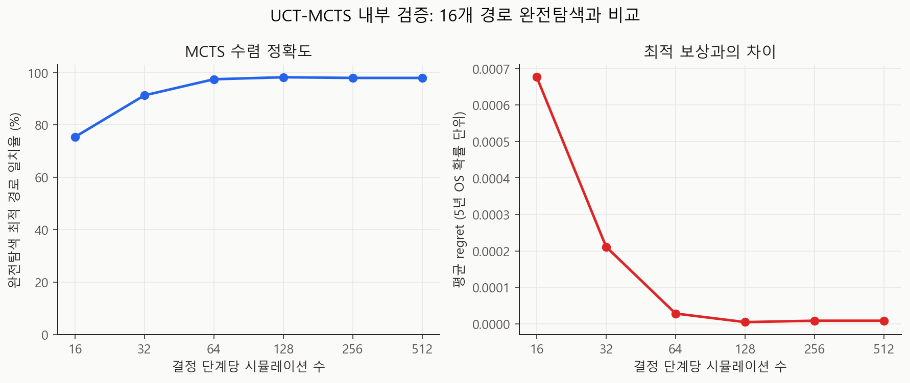
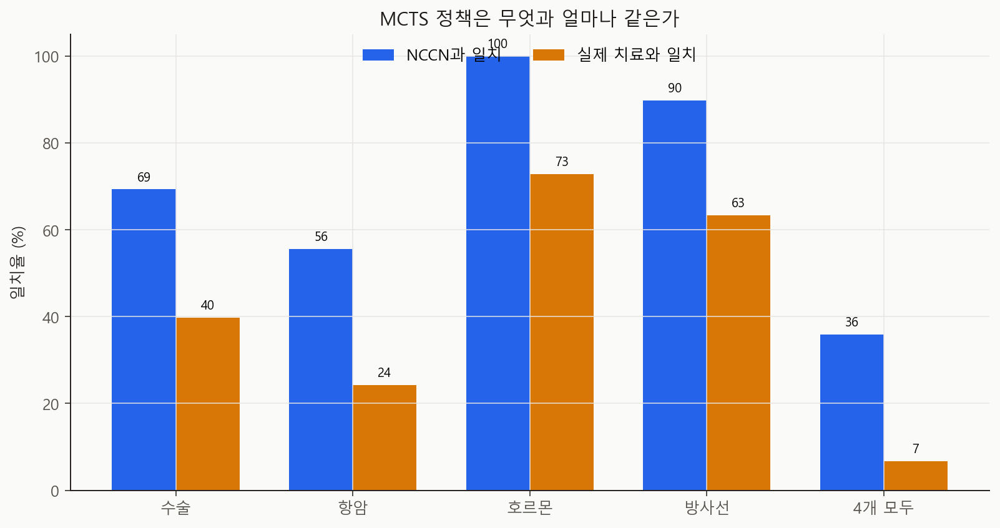
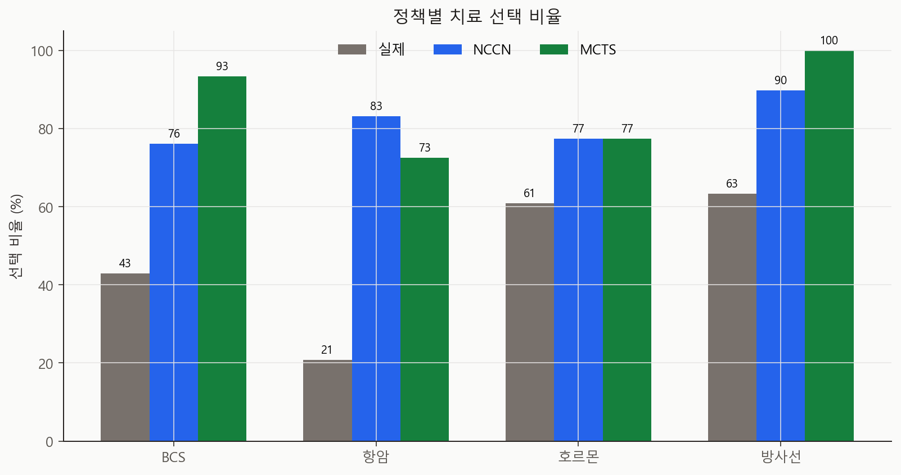
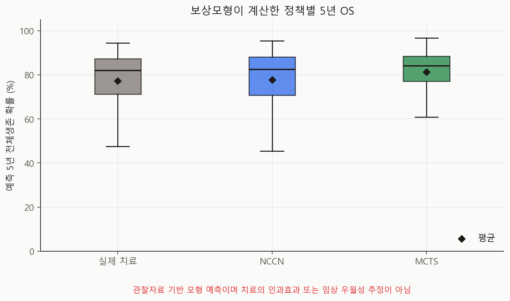

# MCTS PoC v0.1 기술 보고서

- 실행일: 2026-07-11
- 입력: `data/processed/patients_with_nccn.csv`
- 핵심 코드: `analysis/mcts/`, `analysis/06_run_mcts_poc.py`
- 용도: 탐색 파이프라인 검증 및 다음 연구 설계의 기준선
- 금지된 해석: 실제 치료 권고, 치료 인과효과, NCCN 대비 임상적 우월성

## 한 줄 결론

UCT-MCTS 구현은 작은 치료환경의 완전탐색 최적값을 거의 그대로 재현했지만,
현재 보상모형은 오래된 관찰자료의 연관성을 학습하므로 임상적으로 유효한 정책은
아닙니다. **탐색 엔진은 작동했고, 다음 병목은 인과적으로 타당한 환자환경과
보상모형입니다.**

## 설계

### 코호트 분리

| 구분 | 환자 수 | 사용 목적 |
|---|---:|---|
| 전체 입력 | 2,509 | NCCN 결과가 붙은 METABRIC |
| 모형 코호트 | 1,955 | OS와 네 실제 치료가 모두 존재 |
| 학습 | 1,174 | Cox 계수 학습 |
| 검증 | 391 | L2 penalizer 선택 |
| 테스트 | 390 | 최종 성능·MCTS 평가 |
| NCCN 비교 가능 테스트 | 284 | 네 NCCN 결정이 모두 계산 가능 |

분자아형과 사망 사건을 층화해 `60/20/20`으로 한 번 분리했고, 배정은
`tables/cohort_split.csv`에 고정했습니다.

### 보상모형

- 결과: 60개월 전체생존 확률
- 모형: L2 규제 Cox proportional hazards
- 기본 변수: 나이, 종양 크기, 양성 림프절 수, 병기, 등급, 폐경, 분자아형
- 행동 변수: 수술, 항암, 호르몬, 방사선
- 상호작용: 아형-항암, HR-호르몬, 수술-방사선, 병기-수술/방사선
- 선택된 penalizer: `0.1` (`0.01`, `0.1`, `1.0` 중 검증 C-index 최대)

결측 연속형 변수는 학습셋 중앙값으로 대체하고 결측 플래그를 함께 넣었습니다.
스케일링 통계는 학습 데이터에서만 구했습니다.

### MCTS 환경

| 단계 | 행동 |
|---|---|
| 1. 수술 | BCS / MAST |
| 2. 항암 | No / Yes |
| 3. 호르몬 | No / Yes |
| 4. 방사선 | No / Yes |

가능한 완성 경로는 최대 `2^4 = 16`개입니다. 단, HR 음성 환자는 호르몬 치료가
적격 행동이 아니므로 `hormone=0`인 8개 경로만 탐색합니다. UCB1의 탐색 상수는
`sqrt(2)`, rollout은 균등 무작위, 매 단계에서 다시 탐색하는 receding-horizon
방식을 사용했습니다. 작은 환경에서는 완전탐색이 가능하므로 MCTS의 정답
검사기로 사용했습니다.

## 결과

### 보상모형 성능

| 지표 | 값 |
|---|---:|
| 검증 C-index (선택된 penalizer) | 0.701 |
| 학습+검증 C-index | 0.682 |
| 보류 테스트 C-index | 0.677 |
| 테스트 KM 5년 OS | 79.67% |
| 실제 치료를 넣은 평균 예측 5년 OS | 76.63% |

순위 판별력은 중간 수준이고, 5년 평균 예측은 KM 추정치보다 약 3.0%p 낮습니다.
외부 검증과 정식 calibration 분석 전에는 임상 예측모형으로 볼 수 없습니다.

### 탐색 검증

| 단계당 simulation | 완전탐색 최적 경로 일치율 | 평균 regret |
|---:|---:|---:|
| 16 | 75.38% | 0.000677 |
| 32 | 91.28% | 0.000211 |
| 64 | 97.44% | 0.000028 |
| 128 | 98.21% | 0.000005 |
| 512 | 97.95% | 0.000008 |

512회 기준 경로 일치율은 97.95%, 최대 regret은 0.00148이었습니다. 예산별
일치율이 완전히 단조롭지 않은 이유는 각 예산을 독립 고정 시드로 실행한
확률적 rollout 결과이며, 보상 차이는 매우 작았습니다.



### 정책 비교

NCCN 네 결정을 모두 계산할 수 있는 테스트 284명에서:

| 비교 | 수술 | 항암 | 호르몬 | 방사선 | 4개 모두 |
|---|---:|---:|---:|---:|---:|
| MCTS vs NCCN | 69.4% | 55.6% | 100.0% | 89.8% | 35.9% |
| MCTS vs 실제 | 39.8% | 24.3% | 72.9% | 63.4% | 6.7% |
| NCCN vs 실제 | 54.9% | 37.0% | 72.9% | 61.6% | 12.0% |



| 정책 | BCS | 항암 | 호르몬 | 방사선 | 평균 예측 5년 OS |
|---|---:|---:|---:|---:|---:|
| 실제 | 43.0% | 20.8% | 60.9% | 63.4% | 77.20% |
| NCCN | 76.1% | 83.1% | 77.5% | 89.8% | 77.69% |
| MCTS | 93.3% | 72.5% | 77.5% | 100.0% | 81.39% |

MCTS-NCCN 예측 차이의 평균은 +3.70%p지만 중앙값은 +0.21%p로 치우쳐
있습니다. MCTS가 자신의 보상모형을 직접 최대화하므로 높은 점수는 구조적으로
예상되며, 임상적 효과 차이로 해석하면 안 됩니다.





## 무엇을 확인했고, 무엇을 확인하지 못했나

확인한 것:

- 네 단계 치료 경로를 MCTS가 탐색하고 고정 시드로 재현할 수 있습니다.
- 탐색 예산이 늘면 완전탐색 최적값에 빠르게 가까워집니다.
- 환자별 NCCN·실제·MCTS 경로를 같은 테스트셋에서 비교할 수 있습니다.
- 모든 수치의 입력 해시, split, 계수, 환자별 결정을 추적할 수 있습니다.

확인하지 못한 것:

- MCTS 치료가 실제로 생존을 늘린다는 인과효과
- 최신 치료환경으로의 일반화
- 재발, 독성, 환자 선호를 합친 임상 utility
- 치료 후 종양 반응과 상태 변화가 있는 동적 MDP
- 외부 코호트에서의 calibration과 정책 재현성

특히 관찰자료의 치료 선택에는 confounding by indication이 있습니다. 비교효과를
주장하려면 target trial을 먼저 명세하고 propensity/IPW, doubly robust 추정,
민감도 분석과 외부 검증이 필요합니다.

## 산출물 안내

| 파일 | 내용 |
|---|---|
| `metrics.json` | 코호트, C-index, calibration 요약, MCTS regret |
| `run_manifest.json` | 입력 SHA-256, Git 기준점, 시드, 출력 목록 |
| `tables/cohort_split.csv` | 환자별 고정 train/validation/test 배정 |
| `tables/cox_coefficients.csv` | 보상모형 계수와 hazard ratio |
| `tables/patient_policy_decisions.csv` | 테스트 환자별 실제/NCCN/MCTS 결정과 예측 |
| `tables/search_convergence.csv` | 탐색 예산별 완전탐색 일치율 |
| `tables/policy_agreement.csv` | 결정 노드별 정책 일치율 |
| `tables/subtype_summary.csv` | 분자아형별 정책 비교 |

## 재현 명령

```powershell
py -m pip install -r requirements.txt
py analysis\06_run_mcts_poc.py
py analysis\07_visualize_mcts_poc.py
py -m unittest discover -s tests -v
```

## 참고문헌

- Kocsis L, Szepesvari C. [Bandit Based Monte-Carlo Planning](https://doi.org/10.1007/11871842_29). ECML, 2006.
- Cox DR. [Regression Models and Life-Tables](https://doi.org/10.1111/j.2517-6161.1972.tb00899.x). JRSS B, 1972.
- Curtis C, et al. [The genomic and transcriptomic architecture of 2,000 breast tumours reveals novel subgroups](https://doi.org/10.1038/nature10983). Nature, 2012.
- Hernan MA, Robins JM. [Using Big Data to Emulate a Target Trial When a Randomized Trial Is Not Available](https://doi.org/10.1093/aje/kwv254). AJE, 2016.
- Collins GS, et al. [TRIPOD+AI statement](https://doi.org/10.1136/bmj-2023-078378). BMJ, 2024.
