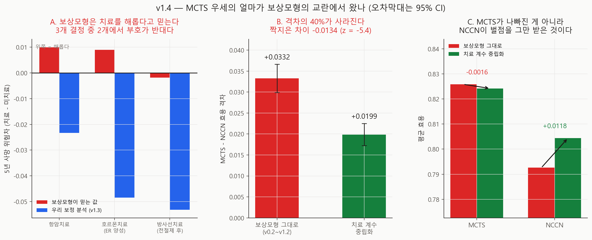
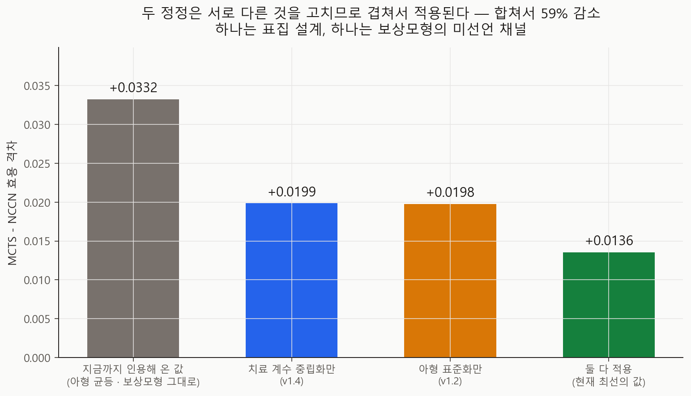

# MCTS 우세의 얼마가 보상모형의 교란에서 왔나 — v1.4

- 실행일: 2026-09-07
- 입력: `data/processed/patients_with_nccn.csv` + `configs/dynamic_v0_5.json`
- 핵심 코드: `analysis/33_run_reward_model_confounding.py`,
  `analysis/34_visualize_reward_confounding.py`
- 용도: 시뮬레이터의 Cox 보상모형이 **관찰자료의 교란**을 학습하고 있고 MCTS가 그것을
  최적화하고 있는지 검증
- 금지된 해석: 실제 임상효과, 치료 권고

## 한 줄 결론

**MCTS 우세의 40%가 보상모형의 교란에서 왔다.** 보상모형의 치료 계수를 중립화하자
효용 격차가 **+0.0332 → +0.0199**로 줄었다(짝지은 차이 −0.0134, **z = −5.37**).
그리고 격차가 줄어든 방식이 결정적이다 — **MCTS가 나빠진 게 아니라(−0.0016) NCCN이
벌점을 그만 받았다(+0.0118).** 미선언 채널이 한쪽 정책을 깎고 있었다는 신호다.

v1.2의 아형 표준화와 합치면 **+0.0332 → +0.0136, 59% 감소**다.

## 추정 대상 (estimand)

> 같은 40명·같은 12시드에서, 보상모형의 치료 계수를 그대로 뒀을 때와 0으로 뒀을 때의
> MCTS−NCCN 효용 격차의 차이.

## 왜 이 분석을 했나 — 두 갈래가 한 번도 만난 적이 없다

이 프로젝트에는 갈래가 둘 있다.

- **인과 갈래**(v0.6~v1.3)는 METABRIC의 치료 배정이 **음성대조가 실패할 만큼** 교란돼
  있다고 결론냈다.
- **시뮬레이터 갈래**(v0.2~v1.2)는 **바로 그 자료로 학습한** Cox 보상모형 위에 서 있고,
  MCTS는 그 모형이 말하는 것을 직접 최적화한다.

둘을 붙여본 적이 없다. 붙이면 이렇게 된다.

| 항목 | 보상모형이 믿는 것 | 우리 보정 분석 (v1.3) |
|---|---:|---:|
| 항암치료 | HR **1.042** (해롭다) | 위험차 **−0.023** |
| 호르몬치료 | HR **1.046** (해롭다) | 위험차 **−0.048** |
| 전절제 | HR **1.093** (해롭다) | (추정 안 함) |
| 방사선치료 | HR 0.939 (이롭다) | 위험차 −0.053 |

**세 결정 중 둘이 부호가 반대다.** 그리고 v0.1 정적 비교에서 MCTS가 NCCN과 갈린
**모든 방향**이 그 계수가 가리키는 쪽이었다(기존 `reports/mcts-poc-v1/tables/policy_summary.csv`).

| | MCTS | NCCN | 모형이 믿는 방향 |
|---|---:|---:|---|
| 항암 | 72.5% | 83.1% | 해롭다 → 덜 쓴다 ✓ |
| 방사선 | 100% | 89.8% | 이롭다 → 더 쓴다 ✓ |
| 유방보존술 | 93.3% | 76.1% | 전절제가 해롭다 → 보존 ✓ |

이것은 **v0.5가 응답 채널에서 찾은 것과 같은 결함이 한 단계 위에** 있는 것이다.
CLAUDE.md가 최우선 결함으로 규정한 형태 그대로다 — 선언되지 않은 임상 가정이 환경에
박혀서 한쪽 정책에 이득을 준다.

## 설계

`RegularizedCoxRewardModel.neutralise_treatment_terms()`는 치료에 의존하는 계수 12개를
전부 0으로 둔 사본을 만든다. 기저위험과 **환자 특성 계수는 그대로**여서 모형은 여전히
환자를 위험도 순으로 세운다(C-index 0.666 → 0.656). 다만 **플랜을 스스로 선호하지
않는다**(16개 플랜 점수의 폭 0.0485 → 0.000000).

중립화 대상: `surgery_mast`, `chemo`, `hormone`, `radio`와 그 상호작용 8개.
적합된 계수 인덱스에서 읽으므로 **새 상호작용항이 추가돼도 빠져나갈 수 없다.**

- 코호트: v1.2의 겹치지 않는 두 코호트 A+B = **40명**
- 시드 12개 · 예산 1024 · episode 40 · `configs/dynamic_v0_5.json`
- 두 팔이 **같은 시드**를 쓰므로 시드 짝지은 검정이 가능하다

**재현 검사**: 그대로 팔의 격차가 v1.2 합산값 **0.0332486805555556**과 `1e-9` 이내로
일치한다(`reproduces_v1_2 = true`). 비교의 기준선이 흔들리지 않았다.

### 사전 선언한 예측 (실행 전 코드에 기록)

| # | 예측 | 결과 |
|---|---|---|
| 1 | **주 예측** — 중립화하면 격차가 **작아진다** | **적중** (−0.0134, z = −5.37) |
| 2 | 중립화해도 격차는 **양수로 남는다** | **적중** (+0.0199) |
| 3 | MCTS 치료율이 NCCN 쪽으로 **이동한다** | **빗나감 — 아래 참조** |

## 결과



### ① 격차의 40%가 사라진다

| | 효용 격차 | 시드 SE |
|---|---:|---:|
| 보상모형 그대로 (v0.2~v1.2) | **+0.0332** | 0.0017 |
| 치료 계수 중립화 | **+0.0199** | 0.0013 |
| 짝지은 차이 | **−0.0134** | 0.0025 (z = **−5.37**) |

**격차의 40.3%가 보상모형의 치료 계수에서 왔다.**

### ② 줄어든 방식이 진단이다

| 정책 | 그대로 | 중립화 | 변화 |
|---|---:|---:|---:|
| MCTS | 0.8258 | 0.8242 | **−0.0016** |
| NCCN | 0.7926 | 0.8043 | **+0.0118** |

**MCTS는 거의 그대로고 NCCN이 올라갔다.** 격차의 88%가 NCCN 쪽에서 닫혔다.

이게 왜 결정적인가: 만약 MCTS가 정말 더 나은 치료를 찾고 있었다면, 모형을 중립화해도
MCTS의 효용이 유지되고 NCCN도 그대로여야 한다. 실제로는 **NCCN이 벌점을 받고 있었다.**
NCCN은 가이드라인대로 치료를 처방하는데, 모형이 치료를 해롭다고 믿었으므로 그 처방마다
효용이 깎이고 있었다.

**비교가 기울어 있었다.** 우리 연구 질문("가이드라인이 최적인가")에서 이것은 성능
문제가 아니라 무효화 사유다.

### ③ 예측 3은 빗나갔다 — 그리고 그 이유가 더 정확한 그림을 준다

"MCTS 치료율이 NCCN 쪽으로 이동한다"고 적었는데, **절반만 맞았다.**

| 결정 | MCTS 그대로 → 중립화 | NCCN | 판정 |
|---|---|---:|---|
| 항암 없음 | 76.3% → **68.9%** | 7.5% | NCCN 쪽으로 ✓ |
| 호르몬 없음 | 76.6% → **70.4%** | 50.0% | NCCN 쪽으로 ✓ |
| 방사선 없음 | 59.9% → **72.1%** | 24.3% | **멀어짐** ✗ |
| 전절제 | 41.5% → **52.6%** | 37.5% | **멀어짐** ✗ |

예측을 잘못 적었다. 계수가 **결정마다 반대 방향**을 가리키는데(항암·호르몬은 해롭다,
방사선·보존술은 이롭다) 하나의 방향을 예측한 것이 잘못이다.

정확한 서술은 이것이다: **MCTS의 행동 구성은 계수를 양방향으로 따라갔다.** 계수가
치료에 반대하던 곳에서는 중립화가 MCTS를 NCCN 쪽으로 밀었고, 계수가 치료에 찬성하던
곳에서는 반대쪽으로 밀었다. 근본 주장(MCTS가 계수를 따라간다)은 **더 날카로운 형태로
지지된다.**

### ④ 두 정정은 겹쳐서 적용된다



| 무엇을 고쳤나 | 값 | 원래 대비 |
|---|---:|---:|
| 지금까지 인용해 온 값 | +0.0332 | — |
| 치료 계수 중립화만 (v1.4) | +0.0199 | −40% |
| 아형 표준화만 (v1.2) | +0.0198 | −41% |
| **둘 다 적용** | **+0.0136** | **−59%** |

두 정정은 **서로 다른 것을 고친다** — 하나는 표집 설계, 하나는 보상모형의 미선언
채널이다. 따라서 대안이 아니라 **겹쳐서** 적용된다. 아형 표준화 값이 v1.2가 보고한
+0.0198과 일치하는 것이 이 계산의 검산이다.

## 무엇이 바뀌나

1. **새 실험은 치료 중립 보상모형을 쓴다.** v0.5가 응답 채널에 한 것과 같은 처방이고,
   같은 근거다 — 미선언 채널은 중립화하고 실제 이득은 선언된 config 파라미터로 옮긴다.
2. **인용 헤드라인이 +0.0332에서 +0.0199로 바뀐다**(아형 균등 표본 기준).
   아형 표준화까지 적용한 값은 **+0.0136**이다. v0.2~v1.2 리포트의 수치는 옛 환경의
   기록으로 그대로 두고, `*-v0.5env`와 같은 방식으로 취급한다.
3. **"MCTS가 NCCN보다 낫다"의 남은 근거는 선언된 채널뿐이다** — 치료 시점(timing),
   반응, 독성, 재발. 이것들은 config에 적혀 있고 민감도 분석이 닿는다.
4. **Cox 보상모형의 역할을 "예후"로 한정한다.** 치료 효과는 config가 담당한다.
   이것은 장기 비전(엔진과 질환 환경의 분리)과도 맞는 구조다.

## 한계 (심각도 순)

- **중립화는 임시 처방이다.** 치료 계수를 0으로 두면 환경에 **자료에서 온 치료 효과가
  전혀 없다.** 더 나은 해법은 config의 치료 파라미터를 인과추정치로 채우는 것인데,
  v1.3의 음성대조가 실패했으므로 그 추정치를 아직 쓸 수 없다. **K-CURE에서 수행상태·
  동반질환을 확보해야 풀린다.**
- **중립화가 옳은 방향인지는 자료가 말해주지 않는다.** "치료 계수가 교란됐다"는 판단은
  v1.3의 인과추정에 기대고 있는데, 그 추정 자체가 음성대조를 통과하지 못했다. 확실한
  것은 **두 추정이 서로 부호가 반대**라는 것이고, 둘 다 맞을 수는 없다.
- **남은 +0.0199도 선언된 합성 가정 위의 값**이다. v1.0~v1.2가 보인 대로 그 가정들의
  상위 2개는 우리가 정한 **가치판단**이다.
- **C-index가 0.666 → 0.656으로 떨어진다.** 치료 계수가 예측력을 조금 갖고 있었다는
  뜻이고, 그 예측력이 **환자 중증도**에서 왔다는 것이 교란 해석과 일관된다.
- 단일 코호트 40명·시드 12개다.

## 다음 단계

1. **K-CURE 수행상태·동반질환** ← 이 결함의 근본 해법. 명세는 갱신했다
   (`docs/k-cure-adaptation.md`)
2. utility 가중치 **공동 사전등록** ← 여전히 사람 검토 대기
3. config의 치료 파라미터를 인과추정치로 채우는 설계 (음성대조 통과가 선행 조건)
4. 교란요인 목록 임상 검토

## 산출물

| 파일 | 내용 |
|---|---|
| `metrics.json` | 사전 예측·판정·두 팔·아형 표준화·모형 대 인과 대조 |
| `run_manifest.json` | 입력 SHA-256·시드·커밋 |
| `figures/fig38_reward_confounding.png` | 부호 불일치·격차 감소·NCCN이 올라간 것 |
| `figures/fig39_headline_corrections.png` | 두 정정과 그 합 |
| `tables/reward_model_coefficients.csv` | 적합된 계수 29개와 치료항 표시 |
| `tables/implied_vs_causal.csv` | 결정별 모형 대 인과 위험차 |
| `tables/per_seed_gaps.csv` | 팔 × 시드 격차 |
| `tables/action_mix.csv` | 팔 × 정책 × 결정별 행동 구성 |
| `tables/subtype_gaps.csv` | 팔 × 아형 격차와 유병률 가중치 |

## 재현

```powershell
py analysis\33_run_reward_model_confounding.py
py analysis\34_visualize_reward_confounding.py
```

`33`은 약 12분(2팔 × 12시드 × 40명).

## 참고문헌

- Hernán MA, Robins JM. *Causal Inference: What If*. CRC. 2020. (교란과 조정)
- Gottesman O, et al. Guidelines for reinforcement learning in healthcare.
  *Nat Med*. 2019;25:16-18. (관찰자료로 학습한 환경에서의 정책 평가 함정)
- Prasad N, et al. Defining the questions RL can answer in healthcare.
  *NeurIPS ML4H*. 2020.
- EBCTCG. *Lancet*. 2011;378:771-84. (호르몬치료의 무작위배정 근거)
