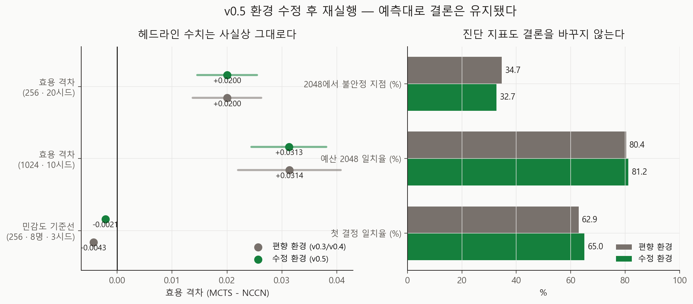

# 다중 시드 강건성 재실행 (v0.5 환경)

- 실행일: 2026-08-28
- 입력: `data/processed/patients_with_nccn.csv` + **`configs/dynamic_v0_5.json`**
- 핵심 코드: `analysis/10_run_multiseed_robustness.py`
- 용도: **강건성 v0.3** 을 v0.5에서 수정한 환경으로 재실행
- 금지된 해석: 실제 임상효과, 인과효과, 최신 치료 우월성

## 왜 다시 돌렸나

v0.3·v0.4는 응답 채널이 선행치료에만 미선언 이득을 주던 환경에서 나왔다. v0.5는 그 편향의
크기를 산술로 특정하고(재발 위험 −6.5~−8.6%), 효용 격차에 미치는 기대 영향이 0.000229로
그 설계의 분해능(0.009942)보다 **43배 작다**고 계산했다.

그건 **예측이지 결과가 아니다.** 실제로 돌려서 확인해야 한다. 설계는 원 리포트와 완전히
동일하고 환경 설정만 `dynamic_v0_5.json`으로 바꿨다.



## 결과 — 예측대로였다

| 지표 | 편향 환경 (v0.3) | 수정 환경 (v0.5env) |
|---|---:|---:|
| 효용 격차 | +0.0200 [+0.0138, +0.0262] | **+0.0200** [+0.0146, +0.0255] |
| 5년 생존 격차 (%p) | +1.91 | **+1.74** |
| 모든 시드에서 양수인가 | False | False |
| 첫 결정 평균 일치율 | 62.9% | **65.0%** |
| 첫 결정 최소 일치율 | 50% | 50% |

효용 격차는 소수점 넷째 자리까지 같았다. 신뢰구간이 약간 좁아지고 첫 결정 일치율이
2.1%p 올랐지만, **v0.3의 결론은 하나도 바뀌지 않는다** — 우세는 여전히 작고, 여전히
모든 시드에서 양수가 아니며, 환자 절반의 첫 결정은 여전히 난수에 갈린다.

## 원 리포트와의 관계

원 리포트(`reports/robustness-v0.3/`)는 **편향 환경이 무엇을 냈는지에 대한 기록**으로 남긴다.
지우지 않는 이유는 그 수치가 이미 회의록·이야기·숫자화해에 인용돼 있고, 매니페스트의
`git_commit_before_run`으로 재현 가능하기 때문이다. 앞으로 인용할 값은 이 리포트다.

설계·판별 논리·한계는 원 리포트와 동일하므로 반복하지 않는다. 그쪽을 함께 읽어야 한다.

## 산출물

`metrics.json`, `run_manifest.json`, `tables/` 는 원 리포트와 같은 구조다.

## 재현

```powershell
py analysis/10_run_multiseed_robustness.py
py analysis_visualize_env_refresh.py
```
