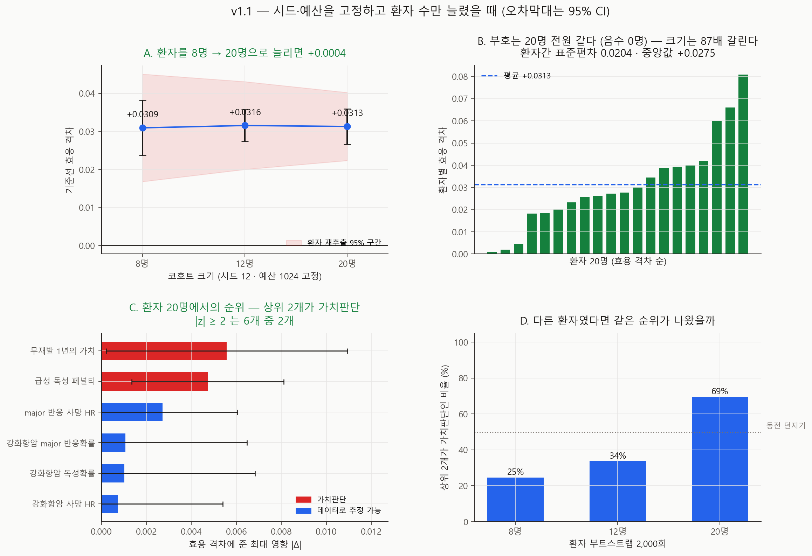

# 민감도 재실행 — 환자 수를 늘리면 v1.1

- 실행일: 2026-09-04
- 입력: `data/processed/patients_with_nccn.csv` + `configs/dynamic_v0_5.json`
- 핵심 코드: `analysis/26_run_sensitivity_patients.py`, `analysis/27_visualize_sensitivity_patients.py`
- 용도: v1.0이 마지막 병목으로 지목한 **환자 8명**을 흔들어, 순위가 표본에 얼마나 의존하는지 측정
- 금지된 해석: 실제 임상효과, 인과효과, 최신 치료 우월성

## 한 줄 결론

**헤드라인 수치는 처음으로 움직이지 않았고**(8명 +0.0309 → 20명 +0.0313, 이동 **+0.0004**),
**결론도 살아남았지만**(세 코호트 모두 상위 2개가 가치판단), **8명은 그 결론을 지지할 수
없었다.** 환자를 다시 뽑아 보면 8명에서 "상위 2개가 가치판단"이 나오는 비율은 **24.6%**로
동전 던지기보다 낮고, 20명에서야 **69.5%**가 된다. 그 사이에 임상 파라미터들의 영향은
**대부분 사라졌다** — 강화항암 독성확률의 |Δ|는 0.0074에서 **0.0010으로** 줄었다.

## 추정 대상 (estimand)

> 각 가정을 v0.3이 정한 범위의 양 끝으로 옮겼을 때 MCTS−NCCN 효용 격차가 움직이는
> 최대 절댓값. 시드 12개·예산 1024 고정, 코호트를 8 → 12 → 20명으로 확대.

부수적으로 **환자간 효용 격차의 분포** 자체를 추정 대상으로 함께 보고한다. 이 연구가
지금까지 평균만 봐 온 양이다.

## 왜 이 분석을 했나

v1.0은 손댈 수 있는 두 손잡이를 정리했다 — 시드 12개, 예산 1024. 그리고 남은 것을
명시하며 끝났다: **환자 8명**. v0.4(예산)와 v1.0(시드)에서 각각 헤드라인이 0.014와
0.019 움직였으므로, 세 번째 손잡이도 같은 크기로 움직일 것을 예상했다.

## 설계

| 코호트 | 아형당 | 역할 |
|---|---:|---|
| 8명 | 2 | **v1.0 재현 검사** — 설정이 동일하므로 숫자가 그대로 나와야 한다 |
| 12명 | 3 | 중간점 |
| 20명 | 5 | 본 실험 |

- 고정: 시드 12개, 예산 1024, episode 40, `configs/dynamic_v0_5.json`, v0.3의 13개 변형과
  파라미터 범위. 움직인 것은 환자 수 하나뿐이다.
- **점을 셋 잡은 이유**: 두 점은 "움직였다"만 말하고 **"아직 움직이는 중인지"** 는 말하지
  못한다.
- **코호트는 중첩(nested)이다.** `balanced_subtype_sample`이 아형별로 같은 난수 순열의
  앞에서부터 뽑으므로 20명은 8명을 포함한다(실행 로그 `nested=True`). 추가된 12명은
  다른 사람으로 **교체**된 것이 아니라 **덧붙은** 것이다.
- **사전 선언**: 목표 표준오차 **0.005**를 실행 전에 코드에 고정했다
  (`TARGET_STANDARD_ERROR`). 순위를 매기려는 효과들이 0.003~0.012 규모이므로 그보다
  작아야 한다는 기준이며, 분포를 본 뒤에 고른 값이 아니다.
- **환자 부트스트랩 2,000회**: 환자 인덱스를 복원추출해 모든 변형에 같은 인덱스를 적용하고
  순위를 다시 매긴다. v1.0의 짝지은 표준오차는 "다른 **시드**였다면?"에 답하지만, 심사자가
  묻는 것은 "다른 **환자**였다면?"이다.

## 재현 검사부터

| | v1.0 (8명·12시드·1024) | 이번 실행 |
|---|---:|---:|
| 기준선 효용 격차 | 0.030945833333333377 | 0.030945833333333363 |
| 차이 | | **1.4 × 10⁻¹⁷** |
| 영향 순위 | | **완전 일치** |

부동소수점 오차 수준에서 같다. 파이프라인이 v1.0 이후 흔들리지 않았다.

## 결과



### ① 헤드라인이 처음으로 움직이지 않았다

| 무엇을 흔들었나 | 헤드라인 이동 | 출처 |
|---|---:|---|
| 예산 256 → 1024 | **+0.0139** | v1.0 |
| 시드 3 → 12 | **+0.0191** | v1.0 |
| **환자 8 → 20** | **+0.0004** | 이번 |

| 코호트 | 기준선 효용 격차 | 시드 SE | 환자 재추출 SE |
|---|---:|---:|---:|
| 8명 | +0.0309 | 0.0037 | 0.0072 |
| 12명 | +0.0316 | 0.0022 | 0.0059 |
| 20명 | +0.0313 | 0.0024 | 0.0046 |

이 프로젝트에서 손잡이를 흔들었는데 헤드라인이 버틴 첫 사례다. 다만 **표본 재추출 오차가
시드 오차의 두 배**라는 점은 남는다 — 평균이 안정적인 것과 그 평균이 정밀한 것은 다르다.

### ② 필요한 환자 수는 17명이었다

20명 기준 환자간 표준편차는 **0.0204**다. `se = sd/√n`을 뒤집으면 사전 선언한 목표
SE 0.005에 도달하는 데 **17명**이 필요하다.

| 코호트 | 환자 재추출 SE | 목표 0.005 |
|---|---:|---|
| 8명 | 0.0072 | **미달** |
| 12명 | 0.0059 | 미달 |
| 20명 | 0.0046 | **충족** |

이 연구에서 설계 파라미터가 **충분하다**고 말할 수 있게 된 것도 처음이다.

### ③ 부호는 20명 전원 같고, 크기는 87배 갈린다

| | 값 |
|---|---:|
| 환자별 격차 최솟값 | +0.0009 (MB-3711) |
| 중앙값 | +0.0275 |
| 최댓값 | +0.0809 (MB-6100) |
| 최대/최소 | **87배** |
| 음수인 환자 | **0 / 20** |

지금까지 "MCTS가 평균적으로 조금 낫다"고 써 왔는데, 20명을 열어 보면 **전원이 같은
방향**이고 크기만 갈린다. 상위 3명이 전체 합의 **33%**를 가져간다. 즉 평균 +0.031은
**전형적인 환자의 값이 아니라** 소수의 큰 이득이 끌어올린 값이다.

`0/20`을 "MCTS가 항상 낫다"로 읽으면 안 된다. 20명은 20명이고, 최솟값 +0.0009는
사실상 0이다. 말할 수 있는 것은 **이 20명에서는 뒤집힌 환자가 없었다**까지다.

### ④ 임상 파라미터의 영향은 표본이 커지자 사라졌다

|Δ| 변화 (8명 → 20명):

| 가정 | 8명 | 12명 | 20명 | 변화 |
|---|---:|---:|---:|---|
| **무재발 1년의 가치** | 0.0087 | 0.0049 | 0.0056 | −36% |
| **급성 독성 페널티** | 0.0086 | 0.0052 | 0.0047 | −45% |
| major 반응 사망 HR | 0.0046 | 0.0031 | 0.0027 | −41% |
| 강화항암 major 반응확률 | 0.0036 | 0.0018 | 0.0011 | **−70%** |
| 강화항암 독성확률 | 0.0074 | 0.0016 | 0.0010 | **−86%** |
| 강화항암 사망 HR | 0.0027 | 0.0023 | 0.0007 | **−74%** |

가치판단 둘은 40% 안팎으로 줄고 멈춘 반면, 임상 파라미터 셋은 **70~86% 사라졌다.**
8명에서 3위였던 강화항암 독성확률(0.0074)은 20명에서 5위(0.0010)다. 그 자리는
소수 환자의 우연이었다.

### ⑤ 환자 20명에서의 순위

| 순위 | 가정 | \|Δ\| | 짝지은 SE | z | 80% 검출력 MDE |
|---:|---|---:|---:|---:|---:|
| 1 | **무재발 1년의 가치** | 0.0056 | 0.0027 | −2.03 | 0.0077 |
| 2 | **급성 독성 페널티** | 0.0047 | 0.0017 | −2.74 | 0.0048 |
| 3 | major 반응 사망 HR | 0.0027 | 0.0017 | +1.59 | 0.0048 |
| 4 | 강화항암 major 반응확률 | 0.0011 | 0.0028 | −0.39 | 0.0077 |
| 5 | 강화항암 독성확률 | 0.0010 | 0.0030 | −0.34 | 0.0083 |
| 6 | 강화항암 사망 HR | 0.0007 | 0.0024 | +0.30 | 0.0067 |

**|z| ≥ 2인 파라미터가 처음으로 2개가 됐고, 그 둘이 정확히 두 가치판단이다.**
v1.0에서는 6개 중 1개뿐이었다.

3~6위를 "영향 없음"으로 읽으면 안 된다. 이 설계의 최소검출효과(α=.05, 검출력 80%)는
0.0048~0.0083이고 관측값은 그보다 작다. **없다는 것이 아니라 이 표본으로는 못 잡는다.**

### ⑥ 그런데 8명이었다면 이 결론이 나올 수 없었다

환자 부트스트랩 2,000회, "상위 2개가 두 가치판단"인 비율:

| 코호트 | 비율 |
|---|---:|
| 8명 | **24.6%** |
| 12명 | 33.7% |
| 20명 | **69.5%** |

1위로 뽑히는 비율을 보면 이유가 분명하다.

| 가정 | 8명 | 20명 |
|---|---:|---:|
| 무재발 1년의 가치 | 35.4% | **67.3%** |
| 급성 독성 페널티 | 32.0% | 28.4% |
| **강화항암 독성확률** | **25.5%** | **2.2%** |
| 나머지 셋 합 | 7.0% | 2.0% |

**8명에서는 임상 파라미터 하나가 1위 자리를 놓고 삼파전을 벌이고 있었다.** 20명에서
그 후보가 2.2%로 무너지면서 상위 2개가 안정된다.

즉 v0.3·v1.0이 보고한 "상위 2개는 가치판단"은 **결론으로는 맞았지만, 8명은 그것을
지지할 표본이 아니었다.** 세 코호트의 점추정이 모두 같은 답을 낸 것은 독립된 증거가
아니다 — 코호트가 중첩이라 8명은 20명 안에 들어 있다.

그리고 69.5%도 확정은 아니다. 여전히 세 번에 한 번은 다른 순위가 나온다.

## v1.0의 주장별 판정

| v1.0의 주장 | 판정 |
|---|---|
| 상위 2개가 가치판단 (예산 1024) | **유지·강화** — 20명에서 \|z\|≥2가 그 둘뿐 |
| 순위 안의 **순서**는 말할 수 없다 | **유지** — 1·2위 CI가 여전히 겹친다 |
| 부호 반전 없음 | **유지** — 세 코호트 39개 셀 전부 양수 |
| 다음 병목은 환자 수 8명 | **확인** — 목표 SE에 17명 필요, 부트스트랩 24.6% |
| 헤드라인 +0.0309 | **유지** — 20명에서 +0.0313 |

## 무엇이 바뀌나

1. **민감도의 최소 설계에 "환자 20명"을 추가**한다. 시드 12·예산 1024·환자 20이 기준선이다.
2. **8명으로 낸 순위는 인용하지 않는다** — v0.3·v1.0의 순위 서술에 이 조건을 붙인다.
3. **평균만 인용하지 않는다.** +0.031을 쓸 때 환자간 표준편차 0.0204와 87배 격차를 함께 쓴다.
4. **utility 가중치 공동 사전등록의 근거가 단단해졌다** — 20명에서 통계적으로 구분되는
   파라미터가 그 둘뿐이다.

## 한계 (심각도 순)

- **20명도 작다.** 부트스트랩 69.5%는 세 번에 한 번 다른 순위가 나온다는 뜻이다.
  결론을 확정하려면 더 큰 코호트가 필요하다.
- **코호트가 중첩**이라 세 점은 독립이 아니다. 8 → 20의 안정성은 부분적으로 같은 사람을
  다시 세고 있기 때문이다. 겹치지 않는 두 코호트 비교가 더 강한 검사다.
- **환자는 무작위 표본이 아니다.** METABRIC 보류 테스트셋에서 **아형별로 균형을 맞춰**
  뽑았으므로 아형 구성이 실제 유병 분포와 다르다. 어떤 모집단의 평균도 아니다.
- **|z| < 2는 "효과 없음"이 아니다.** MDE 0.0048~0.0083 참조.
- **파라미터 범위는 v0.3에서 가져왔다.** 범위를 바꾸면 순위도 바뀐다.
- **합성 가정 위의 값**이며, 시뮬레이터 자체의 민감도이지 임상 효과가 아니다.

## 다음 단계

1. utility 가중치 **공동 사전등록** — 근거가 v1.1에서 가장 단단해졌다
2. 겹치지 않는 두 코호트로 순위 재검(중첩 문제 해소)
3. 교란요인 목록 임상 검토 (v0.7)
4. 겹침이 확보된 결정(항암·호르몬)의 효과 추정 완성
5. K-CURE 확보 후 순차 전략 비교

## 산출물

| 파일 | 내용 |
|---|---|
| `metrics.json` | 코호트별 순위·재현 검사·환자 이질성·부트스트랩 |
| `run_manifest.json` | 입력 SHA-256·base seed·실행 커밋 |
| `figures/fig33_sensitivity_patients.png` | 기준선 안정성·환자별 분포·순위·부트스트랩 |
| `tables/variant_results.csv` | 13변형 × 3코호트 결과와 표준오차 |
| `tables/parameter_influence.csv` | 파라미터별 최대 영향·짝지은 SE·z |
| `tables/per_patient_gaps.csv` | 환자별 기준선 효용 격차 |

## 재현

```powershell
py analysis\26_run_sensitivity_patients.py
py analysis\27_visualize_sensitivity_patients.py
```

약 2시간(39개 셀 × 12시드). 재현 검사는 `metrics.json`의 `reproduction_check`에서 확인한다.

## 참고문헌

- Saltelli A, et al. *Global Sensitivity Analysis: The Primer*. Wiley. 2008.
- Efron B, Tibshirani RJ. *An Introduction to the Bootstrap*. Chapman & Hall. 1993.
- Gelman A, Carlin J. Beyond Power Calculations. *Perspect Psychol Sci*. 2014.
- Briggs AH, et al. Model parameter estimation and uncertainty analysis
  (ISPOR-SMDM Task Force-6). *Med Decis Making*. 2012.
