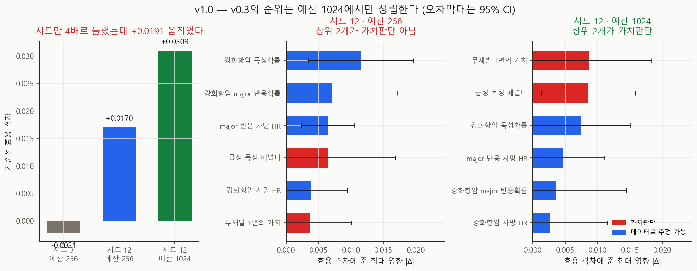

# 민감도 재실행 — 정밀도와 예산을 분리해서 v1.0

- 실행일: 2026-08-28
- 입력: `data/processed/patients_with_nccn.csv` + `configs/dynamic_v0_5.json`
- 핵심 코드: `analysis/24_run_sensitivity_precision.py`, `analysis/25_visualize_sensitivity_precision.py`
- 용도: **v0.3 민감도의 순위가 시드 12개에서도 성립하는지** 검증
- 금지된 해석: 실제 임상효과, 인과효과, 최신 치료 우월성

## 한 줄 결론

> **v1.1 후속(2026-09-04)**: 이 리포트의 **순위 자체는 환자 8명에서 나온 값**이다.
> 환자를 20명으로 늘리면 3위였던 강화항암 독성확률의 |Δ|가 0.0074 → 0.0010으로
> 줄고 5위가 된다. 환자 부트스트랩에서 "상위 2개가 가치판단"의 재현율은 **8명에서
> 24.6%**, 20명에서 69.5%다. 헤드라인 결론은 v1.1에서 유지·강화됐지만
> **여기의 |Δ| 값과 3~6위는 인용하지 않는다.**
> → [환자 수 민감도 v1.1](../sensitivity-patients-v1.1/README.md)

**v0.3의 헤드라인 결론은 살아남았지만, v0.3이 제시한 근거로는 아니었다.** 같은 8명·같은
40 episode·같은 256 예산에서 **시드만 3 → 12로 늘렸더니 기준선이 −0.0021에서 +0.0170으로
0.019 움직였다** — 순위를 매기려던 효과들(0.003~0.012)보다 큰 이동이다. 그 정밀도에서
**256 예산의 순위는 가치판단이 1·2위가 아니었고**(4위·6위), 1024 예산에서만 1·2위가 됐다.
그리고 v0.3이 보고한 **부호 반전은 13개 변형 어디에도 없었다.**

## 추정 대상 (estimand)

> 각 가정을 v0.3이 정한 범위의 양 끝으로 옮겼을 때 MCTS−NCCN 효용 격차가 움직이는
> 최대 절댓값. 8명·수정된 v0.5 환경.

## 왜 이 분석을 했나

v0.9에서 3시드가 셀 평균을 0.010~0.015 치우치게 한다는 것을 봤다. v0.3의 일차원 민감도는
**같은 8명·같은 3시드**로 돌았으므로 같은 문제를 안고 있다. 상위 2개(가치판단)라는 결론은
v0.5env 재실행에서도 유지됐지만, 그 재실행 역시 3시드였다.

## 설계 — 두 변수를 한꺼번에 바꾸지 않았다

| 실행 | 시드 | 예산 | 무엇을 알려주나 |
|---|---:|---:|---|
| `sensitivity-v0.5env` (기존) | 3 | 256 | 기준점 |
| **v1.0 A** | **12** | 256 | **정밀도만의 효과** |
| **v1.0 B** | **12** | **1024** | 현행 표준에서의 순위 |

환자·episode·변형 목록·파라미터 범위는 v0.3과 동일하다. 순위를 나란히 놓기 위해서다.

변형들이 기준선과 **시드를 공유**하므로 Δ를 시드별로 만들어 **짝지은 표준오차**를 낸다.
v0.3은 |Δ| 크기만 있었고 그 차이가 잡음인지 알 수 없었다.

## 결과



### ① 시드만 늘렸는데 기준선이 0.019 움직였다

| 설정 | 기준선 효용 격차 |
|---|---:|
| 시드 3 · 예산 256 (v0.5env) | **−0.0021** |
| 시드 12 · 예산 256 | **+0.0170** |
| 시드 12 · 예산 1024 | **+0.0309** |

시드만 바꾼 이동(+0.0191)이 **예산을 4배 올린 이동(+0.0139)보다 크다.** 그리고 순위를
매기려던 효과들은 0.003~0.012 규모다. **잰 것보다 자의 눈금이 컸다.**

시드 12·예산 1024의 +0.0309는 12명·10시드 헤드라인(+0.0313)에 거의 일치한다 — 이쪽이
수렴한 값이다.

### ② 부호 반전은 없었다

v0.3과 v0.5env는 `any_sign_flip = True`를 보고했다. 12시드에서는 **두 예산 모두 13개 변형
전부 양수**다(음수 셀 0/13).

v0.8은 부호 반전이 사라진 것을 **예산 탓**으로 설명했다. 그 설명은 틀렸다. 여기서는
**256 예산에서도** 반전이 없다. 원인은 예산이 아니라 **정밀도**였다.

### ③ 순위는 예산에 따라 갈린다

**시드 12 · 예산 256** — 가치판단이 상위 2개가 **아니다**

| 순위 | 가정 | \|Δ\| | 짝지은 SE | z |
|---:|---|---:|---:|---:|
| 1 | 강화항암 독성확률 | 0.0115 | 0.0042 | −2.76 |
| 2 | 강화항암 major 반응확률 | 0.0071 | 0.0051 | −1.39 |
| 3 | major 반응 사망 HR | 0.0065 | 0.0021 | −3.07 |
| 4 | **급성 독성 페널티** | 0.0064 | 0.0053 | −1.21 |
| 5 | 강화항암 사망 HR | 0.0038 | 0.0029 | −1.32 |
| 6 | **무재발 1년의 가치** | 0.0036 | 0.0033 | −1.10 |

**시드 12 · 예산 1024** — 가치판단이 상위 2개다

| 순위 | 가정 | \|Δ\| | 짝지은 SE | z |
|---:|---|---:|---:|---:|
| 1 | **무재발 1년의 가치** | 0.0087 | 0.0049 | −1.79 |
| 2 | **급성 독성 페널티** | 0.0086 | 0.0037 | −2.31 |
| 3 | 강화항암 독성확률 | 0.0074 | 0.0039 | −1.91 |
| 4 | major 반응 사망 HR | 0.0046 | 0.0033 | +1.40 |
| 5 | 강화항암 major 반응확률 | 0.0036 | 0.0055 | −0.66 |
| 6 | 강화항암 사망 HR | 0.0027 | 0.0045 | −0.61 |

### ④ 순위 안의 순서는 대부분 구분되지 않는다

예산 1024에서 |z| ≥ 2인 파라미터는 **6개 중 1개**뿐이다. 1위(0.0087)와 2위(0.0086)의
차이는 0.0001로 표준오차(0.004~0.005)의 50분의 1이다.

따라서 말할 수 있는 것은 **"두 가치판단이 상위권에 있다"** 까지이고,
**"무재발 보상이 1위, 독성 페널티가 2위"는 말할 수 없다.**

## 그래서 v0.3의 결론은 어떻게 되나

| v0.3의 주장 | 판정 |
|---|---|
| 결론을 가장 크게 좌우하는 것은 임상 효과가 아니라 **가치판단** | **유지** — 단 예산 1024에서만. v0.3이 돌린 256에서는 성립 안 함 |
| 영향 순위 3~6위 | **인용 불가** — 대부분 서로 구분되지 않음 |
| 가정을 흔들면 **부호가 바뀐다** | **기각** — 3시드 잡음이었다 |
| 기준선 격차 −0.0043 | **기각** — 12시드에서 +0.0170 |

핵심 메시지는 살아남았다. 다만 **v0.3이 그것을 근거로 삼을 수 있었던 것은 우연**이었고,
지금 그 주장을 뒷받침하는 것은 이 리포트다.

## 무엇이 바뀌나

1. **민감도 분석의 최소 설계는 시드 12개·예산 1024**다. 3시드 결과는 인용하지 않는다.
2. **순위의 순서가 아니라 그룹으로 말한다.** "상위권은 가치판단"까지가 이 자료가 지지하는
   해상도다.
3. **"부호가 바뀐다"는 서술을 모든 문서에서 제거**한다(v0.3·v0.5env 리포트에 정정 표기).

## 한계

- 환자 8명은 그대로다. 시드와 예산만 다뤘다. 환자 수를 늘리면 또 달라질 수 있다.
- |z| < 2를 "효과 없음"으로 읽으면 안 된다. **이 설계로 구분 못 함**이다.
- 파라미터 범위는 v0.3에서 가져왔다. 범위를 바꾸면 순위도 바뀐다.
- 합성 가정 위의 값이다.

## 다음 단계

1. v0.3·v0.5env·v0.8 리포트의 해당 서술 정정 (이 커밋에서 수행)
2. utility 가중치 **공동 사전등록** — 근거는 "상위권이 가치판단"
3. 환자 수를 늘린 민감도 — 8명이 다음 병목
4. 교란요인 목록 임상 검토 (v0.7)

## 산출물

| 파일 | 내용 |
|---|---|
| `metrics.json` | 예산별 순위·v0.5env 대조·구분 가능 파라미터 수 |
| `run_manifest.json` | 입력 SHA-256·base seed·실행 커밋 |
| `figures/fig32_sensitivity_precision.png` | 기준선 이동과 예산별 순위 |
| `tables/variant_results.csv` | 13변형 × 2예산 결과와 표준오차 |
| `tables/parameter_influence.csv` | 파라미터별 최대 영향·짝지은 SE·z |

## 재현

```powershell
py analysis\24_run_sensitivity_precision.py
py analysis\25_visualize_sensitivity_precision.py
```

## 참고문헌

- Saltelli A, et al. *Global Sensitivity Analysis: The Primer*. Wiley. 2008.
- Gelman A, Carlin J. Beyond Power Calculations. *Perspect Psychol Sci*. 2014.
- Briggs AH, et al. Model parameter estimation and uncertainty analysis
  (ISPOR-SMDM Task Force-6). *Med Decis Making*. 2012.
