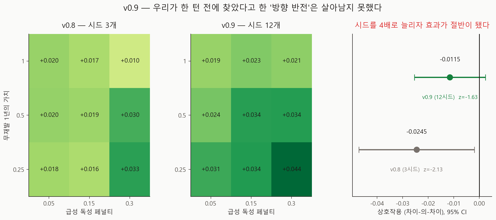

# 가치판단 상호작용 확인 실험 v0.9

- 실행일: 2026-08-28
- 입력: `data/processed/patients_with_nccn.csv` + `configs/dynamic_v0_5.json`
- 핵심 코드: `analysis/22_run_utility_interaction_confirm.py`, `analysis/23_visualize_interaction_confirm.py`
- 용도: **v0.8이 보고한 "두 가치판단이 서로의 방향을 뒤집는다"를 확정하거나 기각**
- 금지된 해석: 실제 임상효과, 인과효과, 최신 치료 우월성

## 한 줄 결론

**우리가 한 턴 전에 찾았다고 한 방향 반전은 살아남지 못했다.** 시드를 3개에서 12개로
늘리자 상호작용이 −0.0245에서 **−0.0115로 절반**이 되고, z는 −2.13에서 −1.63으로
떨어져 사전에 정한 잡음 기준(|z| < 2) 아래로 들어갔다. 그리고 **부호 반전 자체가
없었다** — 독성 페널티를 올리면 두 보상 수준 모두에서 격차가 커진다(+0.0129, +0.0013).
남은 것은 반전이 아니라 **약화**이며, 그마저 잡음과 구분되지 않는다.

## 추정 대상 (estimand)

> 수정된 v0.5 환경에서, 무재발 보상의 양 끝점 사이에서 급성 독성 페널티가 MCTS−NCCN
> 효용 격차에 주는 효과의 차이(모서리 차이-의-차이).

## 사전에 정한 판정 규칙

실행 **전에** 코드에 박아 두었다(`PRESPECIFIED` 상수, `metrics.json`에도 기록).

| 조건 | 판정 |
|---|---|
| \|z\| ≥ 3 **이고** v0.8과 부호 일치 | confirmed |
| \|z\| < 2 | **noise** |
| 그 사이 | unresolved |

사후에 결과를 보고 기준을 고르지 않기 위해서다. 결과는 |z| = 1.63 → **noise**.

## 설계 — 정밀도만 바꿨다

| 항목 | v0.8 | v0.9 |
|---|---:|---:|
| 시드 | 3 | **12** |
| 환자 | 8 | 8 |
| episode | 30 | 30 |
| 탐색 예산 | 1024 | 1024 |
| 격자 | 3×3 | 3×3 (같은 값) |

바뀐 것은 시드 수뿐이다. 시드 4배면 표준오차가 절반이 되므로, 효과가 진짜면 z가 두 배로
커지고 아니면 0 근처로 수렴한다.

두 가지를 개선했다.

- **짝지은 검정**: 네 모서리가 같은 시드를 공유하므로 시드별로 차이-의-차이를 만들어
  대응표본으로 검정한다. v0.8의 비대응 방식이 짊어지던 시드 수준 분산이 빠진다.
  비교 가능하도록 비대응 형태도 함께 보고한다(SE 0.0087, z = −1.33).
- **단순효과를 따로 기록**: 차이-의-차이가 만들어지는 두 재료를 각각 남겨, 반전이
  실제로 일어나는지 직접 볼 수 있게 했다.

## 결과



### 상호작용은 절반이 되고 잡음 아래로 내려갔다

| | 차이-의-차이 | 표준오차 | z |
|---|---:|---:|---:|
| v0.8 (3시드) | −0.0245 | 0.0115 | −2.13 |
| **v0.9 (12시드, 짝지은)** | **−0.0115** | **0.0071** | **−1.63** |
| v0.9 (12시드, 비대응) | −0.0115 | 0.0087 | −1.33 |

### 방향은 뒤집히지 않는다

독성 페널티를 0.05 → 0.30으로 올렸을 때:

| 무재발 보상 | v0.8 (3시드) | v0.9 (12시드) |
|---|---:|---:|
| 0.25 | +0.0153 | **+0.0129** |
| 1.00 | **−0.0092** | **+0.0013** |

v0.8에서 반전을 만들었던 것은 `(보상 1.00, 페널티 0.30)` 셀 하나였다. 3시드에서 +0.0104,
12시드에서 **+0.0208** — 두 배로 올라갔다. 그 셀이 낮게 나온 것이 반전의 전부였다.

### 3시드는 격자 값 자체에도 부족했다

| 셀 | v0.8 (3시드) | v0.9 (12시드) | 차이 |
|---|---:|---:|---:|
| (0.25, 0.05) | +0.0181 | +0.0313 | +0.0132 |
| (0.50, 0.15) | +0.0189 | +0.0336 | +0.0147 |
| (1.00, 0.30) | +0.0104 | +0.0208 | +0.0104 |

상호작용만 흔들린 게 아니라 **셀 평균 자체가 0.010~0.015씩 움직였다.** 12시드 기준선
셀(0.50, 0.15)의 +0.0336은 12명·10시드 실행의 헤드라인(+0.0313)에 가깝다 — 즉 12시드가
수렴한 쪽이고 3시드는 낮게 치우쳐 있었다.

## 그래서 무엇이 남았나

**남은 것**

- 두 가치판단은 **각각** 격차를 크게 움직인다. 무재발 보상을 0.25 → 1.00으로 올리면
  격차가 +0.031 → +0.020(페널티 0.05) 또는 +0.044 → +0.021(페널티 0.30)로 떨어진다.
  헤드라인 +0.0313에 견주면 작지 않은 폭이다.
- 상호작용의 **방향은 약화**(페널티 효과가 보상이 클수록 작아짐)이고 크기는 −0.0115이나,
  이 설계로는 잡음과 구분되지 않는다.

**사라진 것**

- "두 가치판단이 서로의 **방향을 뒤집는다**"는 v0.8의 주장. 지지되지 않는다.
- 그에 근거해 v0.8이 말한 "가중치를 따로 정하면 한쪽을 정하는 순간 다른 쪽의 **방향**이
  달라진다"도 성립하지 않는다. 다만 **크기**는 달라지므로 공동 사전등록의 권고 자체는
  유지된다 — 근거가 "방향 반전"에서 "각각의 영향이 크고 서로 조금 약화시킴"으로 바뀐다.

## 방법론적 교훈

이번 일은 **승자의 저주(winner's curse)** 의 교과서적 사례다. 세 격자를 돌려 가장 큰
상호작용을 골라 보고했고, 그 값은 정밀도를 올리자 절반이 됐다. 여러 후보 중 최대값을
고르면 그 값은 필연적으로 과대추정된다.

이 프로젝트에 남길 규칙:

> **여러 후보 중 가장 큰 것을 골라 보고할 때는, 같은 설계에서 정밀도를 올려 확인하기
> 전까지 "신호"라고만 쓴다.**

v0.8은 이미 z와 표준오차를 함께 보고하고 "확정이 아니라 신호"라고 썼다. 그 표기가
없었다면 이번 정정은 훨씬 아팠을 것이다.

## 한계

- 여전히 환자 8명이다. 시드만 늘렸다.
- 3×3 격자이고 축 범위는 v0.3에서 가져왔다. 곡률을 보기엔 성기다.
- |z| = 1.63은 "효과 없음"의 증거가 아니라 "이 설계로 구분 못 함"이다. 실제 상호작용이
  −0.0115라면 z = 3에 도달하려면 시드가 약 40개 필요하다.
- 합성 가정 위의 값이며 실제 임상효과가 아니다.

## 다음 단계

1. v0.8 리포트·회의록·이야기의 해당 서술을 **정정 표기**와 함께 갱신 (이 커밋에서 수행)
2. utility 가중치 **공동 사전등록** — 근거는 방향 반전이 아니라 각각의 큰 영향
3. v0.3의 일차원 민감도(8명·3시드)도 같은 정밀도 문제를 안고 있다. 재실행 검토
4. 교란요인 목록 임상 검토 (v0.7)

## 산출물

| 파일 | 내용 |
|---|---|
| `metrics.json` | 사전 규칙·v0.8 대조·짝지은/비대응 통계·판정 |
| `run_manifest.json` | 입력 SHA-256·base seed·실행 커밋 |
| `figures/fig31_interaction_confirmation.png` | v0.8 vs v0.9 격자와 상호작용 CI |
| `tables/confirmation_grid.csv` | 9개 셀 평균·표준편차·표준오차 |
| `tables/did_per_seed.csv` | 시드별 차이-의-차이 (짝지은 검정의 원자료) |

## 재현

```powershell
py analysis\22_run_utility_interaction_confirm.py
py analysis\23_visualize_interaction_confirm.py
```

## 참고문헌

- Ioannidis JPA. Why Most Discovered True Associations Are Inflated.
  *Epidemiology*. 2008.
- Gelman A, Carlin J. Beyond Power Calculations: Assessing Type S (Sign) and
  Type M (Magnitude) Errors. *Perspect Psychol Sci*. 2014.
- Saltelli A, et al. *Global Sensitivity Analysis: The Primer*. Wiley. 2008.
